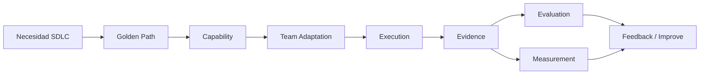

# Adoption Kit

**Para quién es esto**: un equipo de MOA que quiere empezar a usar `MOA-AI-Engineering`
sobre un proyecto real — no para quien diseña la arquitectura (esa documentación vive en
[`../architecture/`](../architecture/)). Esta carpeta es **práctica y operativa**:
responde qué corresponde hacer, paso a paso.

> **No es necesario copiar todo `MOA-AI-Engineering` dentro de otro proyecto.** Es la
> base común/referencia — cada equipo adopta únicamente las capacidades puntuales que
> necesita, el resto queda como catálogo.

## ¿Qué se quiere hacer?

| Necesidad | Camino recomendado |
|---|---|
| Refinar requerimientos | AI-Assisted Requirements |
| Desarrollar con IA | AI-Assisted Development |
| Generar/validar pruebas | AI-Assisted QA |
| Revisar código | AI Code Review |
| Crear un Agent | Agent Creation |
| Integrar un sistema externo | MCP / Integration Onboarding |

Detalle de cada camino: [`../golden-paths/README.md`](../golden-paths/README.md). Hoy
**solo el primero tiene ejecuciones reales** — los demás son conceptuales, sin evidencia
de ejecución todavía (declarado así en el propio documento, sin excepción).

## El flujo completo

## Cómo navegar este kit

1. **Entender el modelo** → [`getting-started.md`](getting-started.md) §1
2. **Elegir el camino** → [`getting-started.md`](getting-started.md) §4, o la tabla de
   arriba
3. **Seleccionar capability** → [`getting-started.md`](getting-started.md) §5 +
   [`../registry/INDEX.md`](../registry/INDEX.md)
4. **Adoptar/adaptar** → [`getting-started.md`](getting-started.md) §7 +
   [`team-adaptation.md`](team-adaptation.md)
5. **Ejecutar sobre trabajo real** → [`getting-started.md`](getting-started.md) §8 +
   [`execution-model.md`](execution-model.md)
6. **Generar Evidence** → [`getting-started.md`](getting-started.md) §9 +
   [`templates/evidence-record.md`](templates/evidence-record.md)
7. **Evaluar** → [`getting-started.md`](getting-started.md) §10 +
   [`templates/evaluation-record.md`](templates/evaluation-record.md)
8. **Medir** → [`getting-started.md`](getting-started.md) §11 +
   [`templates/measurement-record.md`](templates/measurement-record.md)
9. **Dar feedback** → [`contribution-guide.md`](contribution-guide.md)

Modelo mental completo con Definition of Done: [`adoption-flow.md`](adoption-flow.md).

## Biblioteca de capacidades

Catálogo consumible: [`../capabilities/README.md`](../capabilities/README.md) — 6
capacidades reales (Skills/Agents/Instructions/Workflows), cada una lista para
adoptar/adaptar, con su Best Practices guide en
[`../capabilities/best-practices.md`](../capabilities/best-practices.md).

## Las 11 preguntas que responde este kit

| Pregunta | Dónde |
|---|---|
| ¿Qué es esto? | [`getting-started.md`](getting-started.md) §1 |
| ¿Qué se quiere mejorar? | Tabla de arriba, o [`getting-started.md`](getting-started.md) §4 |
| ¿Cómo se elige una capacidad? | [`getting-started.md`](getting-started.md) §5-6 + [`../registry/INDEX.md`](../registry/INDEX.md) |
| ¿Cómo se adapta una capacidad? | [`team-adaptation.md`](team-adaptation.md) |
| ¿Qué debe conservarse (no puede tocarse)? | [`team-adaptation.md`](team-adaptation.md) |
| ¿Cómo se ejecuta? | [`execution-model.md`](execution-model.md) |
| ¿Qué evidencia se genera? | [`getting-started.md`](getting-started.md) §9 |
| ¿Cómo se evalúa? | [`getting-started.md`](getting-started.md) §10 |
| ¿Cómo se mide? | [`getting-started.md`](getting-started.md) §11 |
| ¿Cómo se reporta feedback? | [`contribution-guide.md`](contribution-guide.md) |
| ¿Cómo se propone una capacidad para reutilización? | [`contribution-guide.md`](contribution-guide.md) |

## Qué NO es este kit

No es un tutorial de IA generativa, no enseña a usar Copilot/Claude — asume que el
equipo ya tiene acceso a un asistente. Es una guía de **cómo se relaciona el trabajo de
cada equipo con el Common Core** — descubrir, adoptar, adaptar, generar evidencia,
evaluar, medir, contribuir.

## Antes de empezar — la limitación honesta

La parte técnica de este flujo (descubrir → adoptar → adaptar → ejecutar → generar
evidencia) es self-serve hoy. La parte de gobierno (quién evalúa con mandato, a quién
llega el feedback, quién aprueba una promoción) **todavía depende de que se resuelva
quién gobierna el Common Core** — ver
[`../governance/BLOCKED-DECISIONS.md`](../governance/BLOCKED-DECISIONS.md) #1. Esto no es
un defecto oculto: está documentado así en
[el historial del primer piloto](../docs/history/track-1/G4.4-Real-Adoption-Pilot.md)
tras el primer controlled dry-run (no un piloto real independiente — ver la distinción en
ese mismo documento). Se puede avanzar igual con las partes que sí son self-serve.
