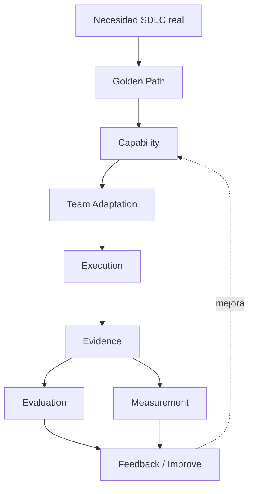
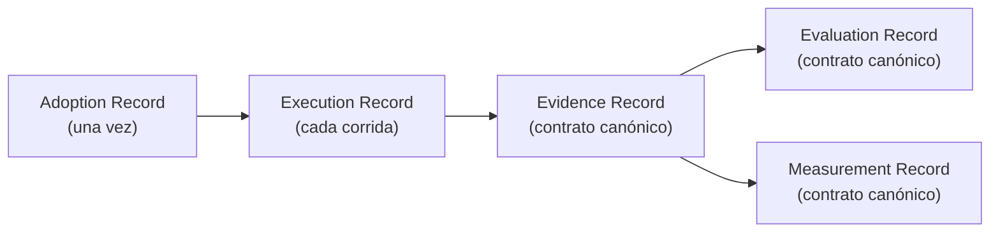

# Adoption Flow — el modelo mental completo

**Para quién es**: cualquiera que quiera ver el flujo completo de un vistazo, o que se
perdió entre Golden Path / Capability / Execution y necesita el mapa.
**Cuándo lo uso**: como referencia visual, no como primer documento a leer (para eso está
[`getting-started.md`](getting-started.md)).
**Qué necesito antes**: nada — este documento es autocontenido.
**Qué obtengo**: el modelo mental completo, la cadena de trazabilidad, y dónde vive cada
artefacto.

## El ciclo completo



## Golden Path ≠ Capability ≠ Execution — la confusión más común

| Concepto | Qué es | Dónde vive | Ejemplo |
|---|---|---|---|
| **Golden Path** | El camino — en qué orden combinar capacidades para un tipo de necesidad | [`../golden-paths/README.md`](../golden-paths/README.md) | "AI-Assisted Requirements": estructurar → criterios → reglas → gaps |
| **Capability** | El activo reutilizable concreto que se usa dentro del camino | [`../capabilities/`](../capabilities/README.md) + [`../registry/`](../registry/INDEX.md) | CAP-002 (`user-story`) |
| **Execution** | La aplicación de esa capability sobre tu proyecto real, una vez | Tu propio repo, registrada con [`templates/execution-record.md`](templates/execution-record.md) | Aplicar CAP-002 al ticket MOA-1234 |

Un Golden Path puede usar más de una Capability. Una Capability puede ejecutarse muchas
veces (una Execution por vez). Nunca al revés.

## La cadena de trazabilidad



- **Adoption Record** — se completa una vez, al decidir usar una capability.
- **Execution Record** — se completa cada vez que la ejecutás, es la bitácora operativa.
- **Evidence Record** — el contrato canónico de que algo ocurrió (
  [`../architecture/evidence-evaluation-measurement.md`](../architecture/evidence-evaluation-measurement.md#1-evidence)).
- **Evaluation Record** — el contrato canónico de si el resultado es correcto.
- **Measurement Record** — el contrato canónico de qué impacto tuvo (o `NOT MEASURED`).

Los primeros dos (Adoption, Execution) son mecanismos prácticos de este Adoption Kit —
**no** son contratos corporativos. Los últimos tres sí lo son, y no se redefinen acá —
ver [`templates/`](templates/) para las 5 plantillas.

## Dónde vive cada artefacto

| Artefacto | Ubicación real |
|---|---|
| Capabilities (fuente/patrón) | [`../capabilities/`](../capabilities/README.md) |
| Registro de capacidades (discovery) | [`../registry/INDEX.md`](../registry/INDEX.md) |
| Golden Paths | [`../golden-paths/README.md`](../golden-paths/README.md) |
| Plantillas operativas | [`templates/`](templates/) |
| Evidence real | [`../evidence/`](../evidence/README.md) |
| Evaluation real | [`../evaluation/`](../evaluation/README.md) |
| Measurement real | [`../measurements/`](../measurements/README.md) |
| Contratos canónicos | [`../architecture/evidence-evaluation-measurement.md`](../architecture/evidence-evaluation-measurement.md) |

## Definition of Done de una adopción

```
[ ] Necesidad SDLC identificada
[ ] Golden Path identificado
[ ] Capability seleccionada
[ ] Capability adaptada
[ ] Actividad real ejecutada
[ ] Resultado generado
[ ] Evidence registrado
[ ] Evaluation registrado
[ ] HITL realizado cuando corresponde
[ ] Measurement registrado o declarado NOT MEASURED/NO DATA
[ ] Feedback registrado
```

Una adopción está "completa" cuando los 11 ítems están marcados — **no** cuando el
resultado de IA "parece bueno". `NOT MEASURED` marcado explícitamente cuenta como
completo; un campo dejado en blanco no.

## Ver también

- [`getting-started.md`](getting-started.md) — la guía paso a paso completa.
- [`execution-model.md`](execution-model.md) — el detalle operativo de los 12 pasos de
  ejecución.
