# Execution Model — cómo aplicar una capability a tu proyecto

**Para quién es**: un equipo que ya eligió una capability (ver
[`getting-started.md`](getting-started.md)) y quiere saber exactamente qué hacer con
ella, paso a paso, sobre trabajo real.
**Cuándo lo uso**: justo antes de ejecutar por primera vez, y como referencia cada vez
que lo hagas de nuevo.
**Qué necesito antes**: una actividad real de tu SDLC, una capability elegida
(`registry/INDEX.md` o `capabilities/README.md`), y acceso a un asistente de IA.
**Qué obtengo**: un resultado trazable — Evidence, Evaluation, y Measurement (o `NOT
MEASURED`, explícito).

## Los 12 pasos

```mermaid
flowchart LR
    A["Actividad SDLC real"] --> B["Golden Path"]
    B --> C["Capability"]
    C --> D["Contexto del proyecto"]
    D --> E["Asistente IA"]
    E --> F["Resultado"]
    F --> G["Human Review"]
    G --> H["Evidence"]
    H --> I["Evaluation"]
    I --> J["Measurement"]
    J --> K["Feedback"]
```

1. **Seleccionar actividad real** — un ticket, un requerimiento, un diff real de tu
   proyecto. Nunca un ejemplo inventado para "probar el sistema".
2. **Seleccionar Golden Path** — ver la tabla "¿Qué quieres hacer?" en
   [`README.md`](README.md). El Golden Path te dice *en qué orden* combinar capacidades
   para ese tipo de actividad.
3. **Seleccionar capability** — dentro del Golden Path elegido, la capability concreta
   (Skill/Agent/Workflow/Instruction) que vas a usar. Ver
   [`registry/INDEX.md`](../registry/INDEX.md) para elegir con evidencia, no por nombre.
4. **Preparar contexto** — juntá lo que el asistente va a necesitar: el ticket real, el
   contenido de la capability, y cualquier instruction/skill de tu propio repo que
   corresponda aplicar en paralelo.
5. **Adaptar capability** — copiá su estructura, completá el contenido de dominio que le
   falta (ver [`team-adaptation.md`](team-adaptation.md) para qué se adapta y qué no).
6. **Ejecutar con la herramienta IA disponible** — Copilot, Claude, u otro asistente
   compatible con tu equipo. `MOA-AI-Engineering` define el patrón y los controles, no
   obliga a un proveedor.
7. **Revisar resultado** — una lectura humana rápida antes de decidir si sigue a Human
   Review formal o si hay que reintentar.
8. **Registrar execution** — completá un
   [`templates/execution-record.md`](templates/execution-record.md): qué herramienta,
   qué input, qué output, qué estado.
9. **Registrar Evidence** — completá el
   [Evidence Record](templates/evidence-record.md) (contrato canónico en
   [`../architecture/evidence-evaluation-measurement.md`](../architecture/evidence-evaluation-measurement.md#1-evidence)).
10. **Evaluar** — declará tus criterios, aplicá el
    [Evaluation Record](templates/evaluation-record.md). Si el resultado puede tener
    impacto real, HITL es obligatorio — no un `model-assisted` alcanza.
11. **Medir** — si hay baseline, completá el
    [Measurement Record](templates/measurement-record.md) con un valor real. Si no hay
    baseline, `NOT MEASURED` — nunca inventado.
12. **Feedback** — si encontraste algo reutilizable o una brecha en la capability misma,
    seguí [`contribution-guide.md`](contribution-guide.md).

## Qué significa cada paso, en una línea

| Paso | Responde |
|---|---|
| Actividad real | ¿Qué necesito resolver hoy, de verdad? |
| Golden Path | ¿En qué orden combino capacidades para este tipo de necesidad? |
| Capability | ¿Qué activo reutilizable concreto voy a usar? |
| Contexto | ¿Qué necesita saber el asistente para no alucinar? |
| Adaptar | ¿Qué de esta capability es mío, y qué es del Common Core? |
| Ejecutar | ¿Qué obtengo al aplicar esto sobre mi caso real? |
| Human Review | ¿Alguien con criterio de negocio miró esto antes de avanzar? |
| Execution | ¿Quedó registro operativo de qué corrí y con qué? |
| Evidence | ¿Quedó registro trazable de que esto ocurrió? |
| Evaluation | ¿El resultado es correcto/suficiente? |
| Measurement | ¿Qué impacto tuvo, si puedo saberlo? |
| Feedback | ¿Esto debería mejorar la capability para el próximo equipo? |

## Ver también

- [`getting-started.md`](getting-started.md) — la guía completa, con más contexto por
  paso.
- [`adoption-flow.md`](adoption-flow.md) — el modelo mental completo y la Definition of
  Done.
