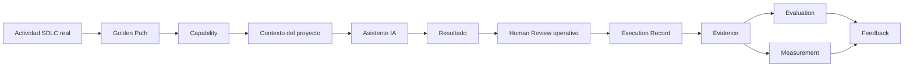

# Execution Model — cómo aplicar una capability a un proyecto real

**Para quién es**: un equipo que ya eligió una capability (ver
[`getting-started.md`](getting-started.md)) y quiere saber exactamente qué hacer con
ella, paso a paso, sobre trabajo real.
**Cuándo se usa**: justo antes de ejecutar por primera vez, y como referencia cada vez
que se repita.
**Qué se necesita antes**: una actividad real del SDLC, una capability elegida
(`registry/INDEX.md` o `capabilities/README.md`), y acceso a un asistente de IA.
**Qué se obtiene**: un resultado trazable — Evidence, Evaluation, y Measurement (o `NOT
MEASURED`, explícito).

## Los 12 pasos

Desde **Evidence** salen dos ramas independientes — Evaluation y Measurement no son
pasos secuenciales entre sí, ambas consumen la misma Evidence por separado.

1. **Seleccionar actividad real** — un ticket, un requerimiento, un diff real del
   proyecto. Nunca un ejemplo inventado para probar el sistema.
2. **Seleccionar Golden Path** — ver la tabla "¿Qué se quiere hacer?" en
   [`README.md`](README.md). El Golden Path indica en qué orden combinar capacidades
   para ese tipo de actividad.
3. **Seleccionar capability** — dentro del Golden Path elegido, la capability concreta
   (Skill/Agent/Workflow/Instruction) que se va a usar. Ver
   [`registry/INDEX.md`](../registry/INDEX.md) para elegir con evidencia, no por nombre.
4. **Preparar contexto** — reunir lo que el asistente va a necesitar: el contenido de la
   capability y el requerimiento real. El requerimiento puede llegar por 2 caminos, sin
   que la capability necesite saber cuál: **contexto conectado** (una referencia, ej. un
   ticket, resuelta por un Context Provider ya configurado — ver
   [`context-providers-quickstart.md`](context-providers-quickstart.md)) o **entrada
   manual** (el requerimiento se aporta directamente, cuando no hay integración
   disponible). Corresponde sumar también cualquier instruction/skill del propio repo
   que deba aplicarse en paralelo.
5. **Adaptar capability** — copiar su estructura, completar el contenido de dominio que
   le falta (ver [`team-adaptation.md`](team-adaptation.md) para qué se adapta y qué
   no).
6. **Ejecutar con la herramienta IA disponible** — Copilot, Claude, u otro asistente
   compatible con el equipo. `MOA-AI-Engineering` define el patrón y los controles, no
   obliga a un proveedor.
7. **Human Review operativo** — una lectura humana rápida del resultado, antes de
   decidir si sigue adelante o si hay que reintentar. Ver la distinción con la
   evaluación formal más abajo.
8. **Registrar execution** — completar un
   [`templates/execution-record.md`](templates/execution-record.md): qué herramienta,
   qué input, qué output, qué estado.
9. **Registrar Evidence** — completar el
   [Evidence Record](templates/evidence-record.md) (contrato canónico en
   [`../architecture/evidence-evaluation-measurement.md`](../architecture/evidence-evaluation-measurement.md#1-evidence)).
10. **Evaluar formalmente** — declarar los criterios, aplicar el
    [Evaluation Record](templates/evaluation-record.md). Si el resultado puede tener
    impacto real, la revisión humana es obligatoria — un resultado `model-assisted` no
    alcanza.
11. **Medir** — si hay baseline, completar el
    [Measurement Record](templates/measurement-record.md) con un valor real. Si no hay
    baseline, `NOT MEASURED` — nunca inventado. Ver más abajo por qué esto es
    independiente del paso 10.
12. **Feedback** — si se encontró algo reutilizable o una brecha en la capability
    misma, corresponde seguir [`contribution-guide.md`](contribution-guide.md). El
    feedback puede nutrirse tanto de lo que resultó de Evaluation como de lo que resultó
    de Measurement.

### Human Review operativo ≠ Human Evaluation formal

**Human Review operativo** (paso 7):
- revisión humana rápida del resultado generado;
- detecta errores obvios;
- permite decidir si se debe reintentar;
- **NO sustituye** la evaluación formal.

**Human Evaluation** (paso 10):
- evaluación formal contra criterios explícitos, declarados antes de evaluar;
- genera el Evaluation Record;
- requiere revisión humana cuando corresponde a promoción o impacto real;
- un resultado `model-assisted` no sustituye la evaluación humana requerida.

### Measurement es independiente de Evaluation (paso 11)

Measurement no viene "después" de Evaluation — ambas consumen la misma Evidence, cada
una respondiendo una pregunta distinta:

- Measurement requiere **baseline** para producir una medición válida.
- Sin baseline: `NOT MEASURED` / `NO DATA`.
- **Nunca debe inventarse** un cero, un porcentaje, ni un impacto — con o sin resultado
  de Evaluation.

## Qué significa cada paso, en una línea

| Paso | Responde |
|---|---|
| Actividad real | ¿Qué hay que resolver hoy, de verdad? |
| Golden Path | ¿En qué orden se combinan las capacidades para este tipo de necesidad? |
| Capability | ¿Qué activo reutilizable concreto se va a usar? |
| Contexto | ¿Qué necesita saber el asistente para no alucinar — conectado (Context Provider) o manual? |
| Adaptar | ¿Qué de esta capability es propio del equipo, y qué es del Common Core? |
| Ejecutar | ¿Qué se obtiene al aplicar esto sobre el caso real? |
| Human Review operativo | ¿Alguien miró esto rápido antes de seguir, o hay que reintentar? |
| Execution | ¿Quedó registro operativo de qué se ejecutó y con qué? |
| Evidence | ¿Quedó registro trazable de que esto ocurrió? |
| Evaluation | ¿El resultado es correcto/suficiente, contra criterios formales? |
| Measurement | ¿Qué impacto tuvo, si hay baseline para saberlo — independiente de Evaluation? |
| Feedback | ¿Esto debería mejorar la capability para el próximo equipo? |

## Ver también

- [`getting-started.md`](getting-started.md) — la guía completa, con más contexto por
  paso.
- [`adoption-flow.md`](adoption-flow.md) — el modelo mental completo y la Definition of
  Done.
