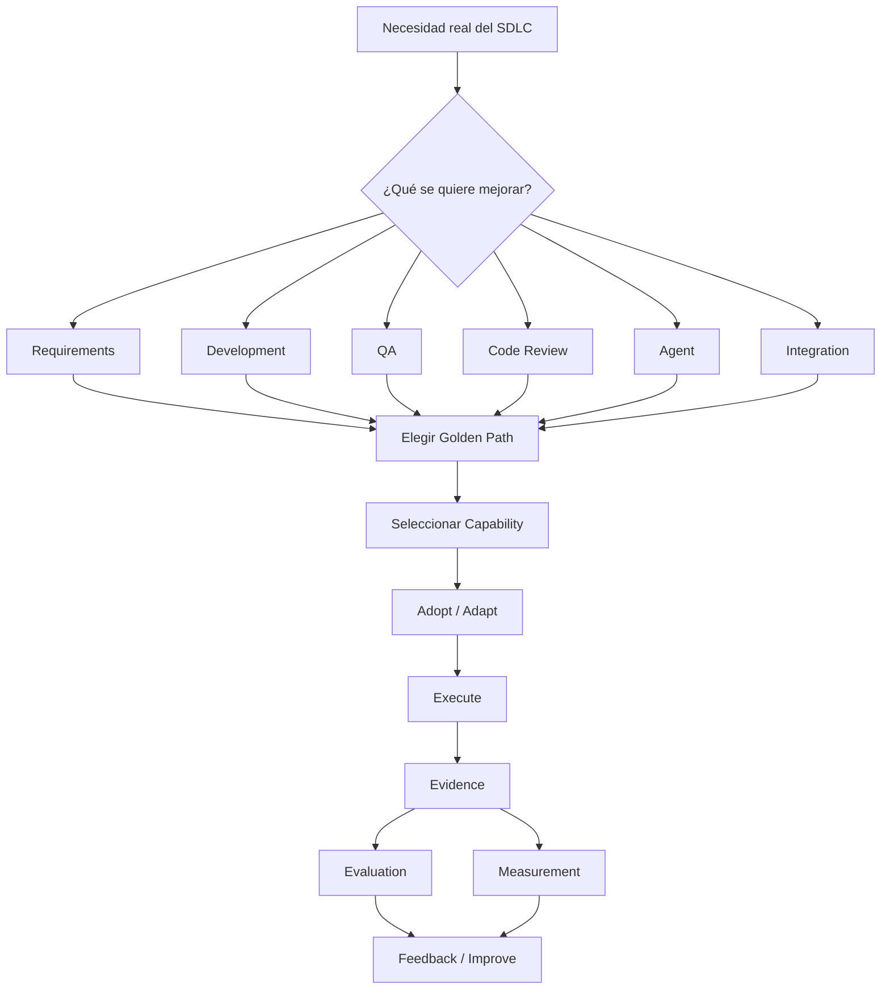

# Getting Started

Un equipo de MOA tiene un proyecto y quiere usar IA para mejorar una actividad de su
SDLC. Esta guía lleva desde esa necesidad hasta un resultado trazable en el propio
repositorio.



## 1. Qué es esto

`ai-engineering` es la base común de AI Engineering para MOA — principios,
gobierno, un Registry de capacidades reales, Golden Paths, y contratos para generar
evidencia, evaluar y medir.

No es un framework obligatorio, no es una plataforma que reemplaza ningún stack, no es
un tutorial de cómo usar Copilot o Claude. No es necesario copiar todo el repositorio
dentro de otro proyecto — se adoptan únicamente las capacidades puntuales que se
necesiten, el resto queda como referencia.

¿Todavía no queda claro qué le ofrece esto al rol propio (Product Owner, developer,
revisor de código, QA, arquitecto)? Ver
[`../README.md#3-para-quién-es-y-qué-le-ofrece-a-cada-rol`](../README.md#3-para-quién-es-y-qué-le-ofrece-a-cada-rol)
antes de seguir — resume, por rol, qué existe hoy y qué resuelve. El detalle de qué hace
cada capacidad concreta, en lenguaje simple, está en
[`../capabilities/README.md#qué-hace-cada-capacidad-explicado-simple`](../capabilities/README.md#qué-hace-cada-capacidad-explicado-simple).

## 2. El camino más corto

**No hace falta clonar ni copiar nada.** El camino más rápido hoy es instalar este
repositorio como plugin de VS Code — 2 minutos, sin depender de ningún administrador:
[`agent-plugin-quickstart.md`](agent-plugin-quickstart.md).

El modelo tiene 4 tipos de capacidad — esto es lo que el plugin trae, y lo que no:

| Tipo | ¿El plugin lo instala? | Por qué |
|---|---|---|
| **Agents** (incluye los que otro Agent invoca como sub-agente, ej. `ticket-kickoff` → `product-owner`) | Sí | — |
| **Skills** | Sí | — |
| **Workflows** (ej. `spec-driven-development`) | Sí | — |
| **Instructions** (ej. `repository-governance`) | **No, a propósito** | Cada equipo la completa con su propia matriz de autonomía — instalarla igual para todos rompería esa regla. Se sigue copiando a mano, ver [`../capabilities/README.md`](../capabilities/README.md) |

Con el plugin instalado, Copilot Chat ya reconoce agents/skills/workflows, listos para
usar sobre un ticket real.

**Alternativas**, según lo que se necesite (ver el detalle completo de las 3 en
[`../capabilities/README.md`](../capabilities/README.md), sección "Camino más maduro"):

- El equipo quiere que los cambios le lleguen solos, sin que cada developer instale nada:
  [`capability-distribution-quickstart.md`](capability-distribution-quickstart.md).
- Solo se quiere probar una capacidad puntual, una sola vez, sin instalar nada: copiar a
  mano el archivo de la capacidad elegida (`capabilities/skills/<nombre>/SKILL.md` o
  `capabilities/agents/<nombre>/AGENT.md`) al repositorio propio — sigue siendo válido
  para una prueba rápida, ver [`../capabilities/README.md`](../capabilities/README.md).

Una vez que la capacidad está disponible (por cualquiera de los 3 caminos), **qué escribir
exactamente**: [`how-to-use.md`](how-to-use.md) — en 2 líneas, sin IDs del Registry ni
jerga. Resumen: describir la tarea real en las propias palabras (ej. *"Necesito refinar
este requerimiento: [requerimiento real]"*), revisar el resultado, y — si se quiere dejar
registro — copiar [`templates/evidence-record.md`](templates/evidence-record.md) a
`records/<tarea>/evidence.md` con el resultado real.

**¿La tarea no tiene ticket en ningún sistema?** No hace falta crear uno — se describe la
tarea directamente en el mensaje. El modelo nunca requirió Jira específicamente: funciona
igual con un ticket de Azure DevOps, o sin ningún ticket (ver
[`../golden-paths/README.md#dos-formas-de-aportar-el-contexto`](../golden-paths/README.md#dos-formas-de-aportar-el-contexto)).

Con esto ya se obtiene el primer resultado. El resto de esta guía es para cuando se
quiera el panorama completo o adoptar más de una capability.

## 3. Qué se necesita configurado, por plataforma

Este modelo se apoya en 3 plataformas: GitHub Copilot, Jira y Azure DevOps. No todo lo
necesario lo configura el equipo — conviene separar siempre estas 2 columnas antes de
asumir que algo no funciona:

| Plataforma | Lo que configura el equipo | Lo que depende de una habilitación previa |
|---|---|---|
| **GitHub Copilot** (asistencia base) | Instalar la extensión de Copilot en el IDE y autenticarse con la cuenta correspondiente | Licencia asignada al usuario, gestionada de forma centralizada |
| **GitHub Copilot Code Review for Azure DevOps** | Nada a nivel individual — se activa a nivel de organización/proyecto | Habilitación sobre el proyecto de Azure DevOps |
| **Jira** (para traer contexto de un ticket automáticamente) | Instalar el cliente MCP de Atlassian Rovo en el IDE y autenticar la cuenta — paso a paso en [`context-providers-quickstart.md`](context-providers-quickstart.md#3a-atlassian-rovo-mcp-v2--runtime-principal-vs-code--github-copilot) | Que el usuario ya tenga permisos sobre el proyecto de Jira correspondiente |
| **Azure DevOps** (para traer contexto de un Work Item automáticamente) | Azure CLI + extensión `azure-devops`, `az login`, variables de entorno — paso a paso en [`context-providers-quickstart.md`](context-providers-quickstart.md#1-prerequisites) | Que el usuario ya tenga permisos sobre la organización/proyecto |

Si algo de la columna derecha todavía no está resuelto, se trata de una dependencia de
alguien fuera del equipo — conviene reportarlo así, sin buscar una configuración
alternativa para evitarlo.

## 4. Elegir qué se quiere mejorar

| Necesidad | Camino recomendado |
|---|---|
| Refinar requerimientos | AI-Assisted Requirements |
| Desarrollar con IA | AI-Assisted Development |
| Generar/validar pruebas | AI-Assisted QA |
| Revisar código | AI Code Review |
| Crear un Agent | Agent Creation |
| Integrar un sistema externo | MCP / Integration Onboarding |

Detalle completo de cada camino: [`../golden-paths/README.md`](../golden-paths/README.md).
Hoy solo el primero (AI-Assisted Requirements) tiene ejecuciones reales — los demás
todavía son conceptuales.

## 5. Elegir una capability

No son lo mismo:

```text
Golden Path
    ↓
Capability
    ↓
Team Adaptation
    ↓
Project Execution
```

- **Golden Path** = cómo resolver una actividad (el camino, la secuencia).
- **Capability** = el activo reutilizable concreto dentro del camino (una Skill, un
  Agent, un Workflow, una Instruction).
- **Execution** = aplicar esa capability sobre un proyecto real, una vez.

Qué hace cada una, en lenguaje simple:
[`../capabilities/README.md#qué-hace-cada-capacidad-explicado-simple`](../capabilities/README.md#qué-hace-cada-capacidad-explicado-simple).
Catálogo técnico completo: [`../registry/INDEX.md`](../registry/INDEX.md) (con evidencia)
o [`../capabilities/README.md`](../capabilities/README.md) (archivos listos para copiar).

## 6. Evaluar antes de adoptar

Conviene abrir la entrada completa en `../registry/entries/<nombre>.md` y revisar, sin
asumir que una responde a la otra:

- **Risk** — riesgo declarado de la capability.
- **Configuration Status** — ¿el archivo está bien armado?
- **Real Use Status** — ¿alguien la usó de verdad, o solo existe configurada?
- **Evidence / Evaluation / Measurement** — referencias a ejecuciones reales, si
  existen.

Esas referencias a ejecuciones listan todo lo acumulado de esa capability, del propio
proyecto y de otros equipos, a veces de fechas distintas. No es necesario leerlas ni
entenderlas para ejecutar la tarea propia — la única lectura obligatoria del Registry es
el cuerpo de la entrada (Propósito, Cuándo usarla, Instrucciones).

## 7. Adoptar / adaptar

1. Abrir la capability elegida (`capabilities/<tipo>/<nombre>/`).
2. Leer su propósito, cuándo usarla y cuándo no.
3. Identificar qué entrada necesita y qué salida produce.
4. Traer su contenido al repositorio del equipo — **si ya se instaló el plugin (sección
   2), esto no aplica**: Skills, Agents y Workflows ya están disponibles, sin copiar
   nada. Si no se instaló el plugin, **2 caminos, según qué se necesita**:
   - **Uso puntual, una sola vez** (probar una capability sobre un ticket real antes de
     comprometerse): copiarla a mano al mecanismo de IA que use el equipo
     (`.github/skills/`, `.github/agents/`, u otro — ver el mapeo en
     [`../capabilities/README.md`](../capabilities/README.md)). Siempre disponible, sin
     pedir nada a nadie.
   - **Adopción del equipo, en curso** (el equipo quiere que `agents`/`skills` se
     mantengan al día automáticamente, sin copiar a mano cada vez que cambian): sumar el
     repo al mecanismo de distribución por Pull Request —
     [`capability-distribution-quickstart.md`](capability-distribution-quickstart.md).
     Requiere una decisión de gobierno (agregar el repo a una lista explícita) y permisos
     de escritura configurados una sola vez — después, los PRs llegan solos.
   - **Instructions, en cualquier caso**: el plugin nunca las instala, a propósito (ver
     tabla de la sección 2) — siempre se completan a mano, por equipo.
5. Adaptar el contenido de dominio: roles, ejemplos, reglas del contexto real.
6. No modificar los contratos comunes (Evidence, Evaluation, Measurement, formato de la
   capability).

Qué se puede cambiar libremente y qué no, con más detalle:
[`team-adaptation.md`](team-adaptation.md).

## 8. Ejecutar

Ejecutar significa aplicar la capability a una actividad real del SDLC — nunca a un
ejemplo inventado para probar el sistema.

**Si el asistente indica que ya existe un registro para la tarea** (mismo `EXEC-ID`, en
`records/<fuente>-<tarea>/`), corresponde elegir según el caso:

1. No cambió nada y solo se quería el mismo resultado → no hay nada que hacer, ese
   registro ya es la evidencia.
2. El ticket cambió, o el resultado anterior tiene algo para corregir → pedirle al
   asistente que cree una nueva ejecución anidada dentro de la misma carpeta de tarea
   (`records/<fuente>-<tarea>/EXEC-<fecha-nueva>-<n>/`) — nunca editar el registro
   anterior.
3. Se puede revisar si el resultado existente es correcto → abrir `evaluation.md` de esa
   ejecución y decidir. Si se está de acuerdo, pedirle al asistente que actualice
   `method: model-assisted` a `method: human`, y complete `evaluator`/
   `hitl_confirmed_by` con el nombre de quien revisa. Si no se está de acuerdo, lo mismo
   pero con `result: FAIL`/`PARTIAL` y la justificación real.

Si no existe registro previo, conviene responder primero cómo se va a dar el contexto:

**Contexto conectado** (si hay un Context Provider configurado): se le da al asistente
una referencia (por ejemplo, un ID de ticket), no el contenido completo — el Context
Provider ya configurado la resuelve automáticamente. Hoy está validado de punta a punta
para Jira (vía Atlassian Rovo MCP) y Azure DevOps. Requiere acceso al sistema
correspondiente, un cliente MCP compatible, y permisos sobre el proyecto o issue — el
flujo es de solo lectura.

**Entrada manual** (si no hay un Context Provider disponible): se le da al asistente el
contenido de la capability más el requerimiento real, copiado del ticket o de donde se
disponga. Este camino siempre está disponible.

En ambos casos, la herramienta concreta puede ser Copilot, Claude, u otro asistente
compatible con el equipo — este modelo define el patrón y los controles, no obliga a un
proveedor.

Detalle operativo completo: [`execution-model.md`](execution-model.md). Detalle técnico
de contexto conectado: [`context-providers-quickstart.md`](context-providers-quickstart.md).

## 9. Generar evidencia

La evidencia demuestra que una ejecución ocurrió — es la prueba, no la opinión sobre si
salió bien (eso corresponde a la evaluación).

La evidencia de cada ejecución vive en un único archivo, propio de esa tarea — nunca
mezclado con el de otro ticket:

1. Crear el propio `EXEC-<fecha>-<n>.md` copiando la plantilla — no reutilizar el de
   otra ejecución.
2. Completar los campos sobre el propio input/output.
3. Dejar `evaluation_reference`/`metric_reference` como pendientes hasta que existan los
   propios.

No es necesario abrir los registros de otros tickets o equipos para esto.

- Archivo a usar: [`templates/evidence-record.md`](templates/evidence-record.md).
- Qué registrar: quién ejecutó, cuándo, con qué capability, sobre qué input, qué output
  produjo.
- Qué no registrar: secretos, credenciales, ni el contenido completo de datos
  sensibles — usar referencias (rutas, links, IDs).

Contrato completo: [`../architecture/evidence-evaluation-measurement.md`](../architecture/evidence-evaluation-measurement.md#1-evidence).
Ejemplos: [`../evidence/README.md`](../evidence/README.md).

## 10. Evaluar

La evidencia responde qué ocurrió; la evaluación responde si el resultado es correcto o
suficiente.

Los criterios se definen antes de mirar el resultado. El veredicto es `PASS`, `PARTIAL`
o `FAIL`, siempre con una justificación. Cuando el resultado puede promoverse o tener
impacto real, se necesita revisión humana — una autoevaluación no la sustituye.

Plantilla: [`templates/evaluation-record.md`](templates/evaluation-record.md). Ejemplos:
[`../evaluation/README.md`](../evaluation/README.md).

## 11. Medir

La medición responde qué impacto tuvo.

Si existe un baseline real, se completa el valor y la unidad reales. Si no existe, se
deja explícito como no medido — es un resultado válido, no una falla. Nunca debe
completarse el campo con un número inventado.

Plantilla: [`templates/measurement-record.md`](templates/measurement-record.md).
Ejemplos: [`../measurements/README.md`](../measurements/README.md).

## 12. Dejar feedback

Si se encuentra algo que valdría la pena que otros equipos usen, o una brecha en la
capability misma, conviene convertirlo en feedback siguiendo
[`contribution-guide.md`](contribution-guide.md).

## 13. Checklist final

```
[ ] Necesidad SDLC identificada
[ ] Golden Path identificado
[ ] Capability seleccionada
[ ] Capability adaptada
[ ] Actividad real ejecutada
[ ] Resultado generado
[ ] Evidence registrado
[ ] Evaluation registrado
[ ] Revisión humana realizada cuando corresponde
[ ] Measurement registrado o declarado explícitamente sin datos
[ ] Feedback registrado
```

## 14. Errores a evitar

- No copiar todo el repositorio dentro de otro proyecto.
- No asumir que existir es lo mismo que funcionar.
- No considerar una salida de IA como aprobada automáticamente.
- No inventar métricas ni baseline.
- No modificar los contratos comunes sin pasar por Assessment.
- No confundir Golden Path con Capability.
- No confundir Evidence (qué ocurrió) con Evaluation (si es correcto) ni con
  Measurement (impacto).

## Ver también

- [`adoption-flow.md`](adoption-flow.md) — el modelo mental completo, en un solo lugar.
- [`execution-model.md`](execution-model.md) — el detalle operativo de ejecutar.
- [`team-adaptation.md`](team-adaptation.md) — qué adaptar, qué no.
- [`contribution-guide.md`](contribution-guide.md) — feedback y contribución.
