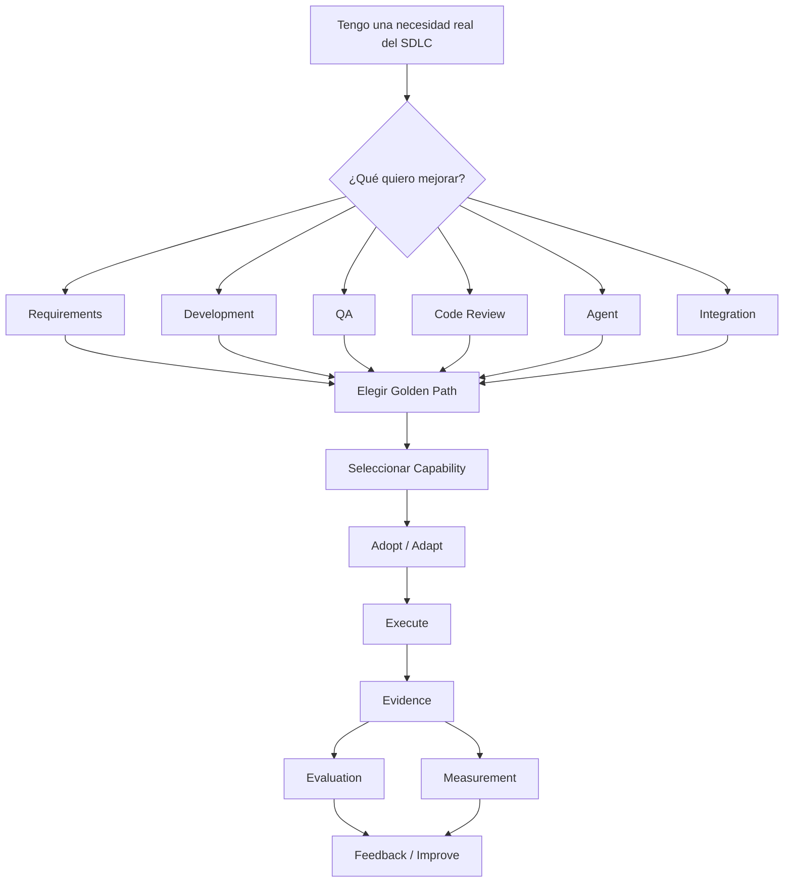

# Getting Started

Tenés un proyecto de MOA y querés usar IA para mejorar una actividad de tu SDLC. Esta
guía te lleva desde esa necesidad hasta un resultado trazable en tu propio repositorio.



## 1. Qué es esto

`MOA-AI-Engineering` es la base común de AI Engineering para MOA — principios, gobierno,
un Registry de capacidades reales, Golden Paths, y contratos para generar evidencia,
evaluar y medir.

No es un framework obligatorio, no es una plataforma que reemplaza tu stack, no es un
tutorial de cómo usar Copilot o Claude. No necesitás copiar todo este repositorio dentro
de tu proyecto — adoptás las capacidades puntuales que necesitás, el resto queda acá como
referencia.

## 2. El camino más corto

No hace falta ninguna herramienta nueva para adoptar esto — tu propio asistente de IA
(Copilot, Claude, el que ya usás) puede hacer todo el trabajo mecánico. Parado en tu
propio repositorio de aplicación, con `MOA-AI-Engineering` clonado o accesible en algún
lugar de tu máquina, pegale esto a tu asistente en modo agente:

```text
Quiero adoptar la capability CAP-002 (user-story) de MOA-AI-Engineering en este
repositorio.

1. Leé capabilities/skills/user-story/SKILL.md del repositorio MOA-AI-Engineering.
2. Copiá su contenido a este repo, en la carpeta que uses para instrucciones/skills de
   IA (si no existe ninguna, preguntame dónde antes de crear una nueva).
3. En la sección "Sobre el rol", preguntame primero qué roles reales existen en este
   dominio antes de completarla — no inventes roles.
4. Mostrame el archivo final antes de guardarlo.
```

Con eso ya tenés la capability en tu repo, adaptada a tu dominio. A partir de ahí:

1. Con tu asistente, sobre un ticket real: *"Usá la capability CAP-002 user-story para
   refinar este ticket: [tu ticket real]"*.
2. Revisá el resultado antes de darlo por bueno.
3. Guardá tu propia evidencia, en tu repo: pedile a tu asistente que copie
   [`templates/evidence-record.md`](templates/evidence-record.md) a algo como
   `records/<tu-tarea>/evidence.md` y lo complete con tu resultado real.

Con eso ya tenés tu primer resultado. El resto de esta guía es para cuando quieras el
panorama completo o adoptar más de una capability.

## 3. Qué necesitás configurado, por plataforma

Este modelo se apoya en 3 plataformas: GitHub Copilot, Jira y Azure DevOps. No todo lo
que necesitás lo configurás vos — separá siempre estas 2 columnas antes de asumir que
algo no funciona:

| Plataforma | Lo que configurás vos, en tu equipo | Lo que depende de una habilitación previa |
|---|---|---|
| **GitHub Copilot** (asistencia base) | Instalar la extensión de Copilot en tu IDE y autenticarte con tu cuenta | Licencia asignada a tu usuario, gestionada de forma centralizada |
| **GitHub Copilot Code Review for Azure DevOps** | Nada a nivel individual — se activa a nivel de organización/proyecto | Habilitación sobre el proyecto de Azure DevOps |
| **Jira** (para traer contexto de un ticket automáticamente) | Instalar el cliente MCP de Atlassian Rovo en tu IDE y autenticar tu cuenta — paso a paso en [`context-providers-quickstart.md`](context-providers-quickstart.md#3a-atlassian-rovo-mcp-v2--runtime-principal-vs-code--github-copilot) | Que tu usuario ya tenga permisos sobre el proyecto de Jira correspondiente |
| **Azure DevOps** (para traer contexto de un Work Item automáticamente) | Azure CLI + extensión `azure-devops`, `az login`, variables de entorno — paso a paso en [`context-providers-quickstart.md`](context-providers-quickstart.md#1-prerequisites) | Que tu usuario ya tenga permisos sobre la organización/proyecto |

Si algo de la columna derecha todavía no está resuelto, es una dependencia de alguien
fuera de tu equipo — reportalo así, sin buscar una forma alternativa de evitarlo.

## 4. Elegí qué querés mejorar

| Necesidad | Camino recomendado |
|---|---|
| Refinar requerimientos | AI-Assisted Requirements |
| Desarrollar con IA | AI-Assisted Development |
| Generar/validar pruebas | AI-Assisted QA |
| Revisar código | AI Code Review |
| Crear un Agent | Agent Creation |
| Integrar un sistema externo | MCP / Integration Onboarding |

Detalle completo de cada camino: [`../golden-paths/README.md`](../golden-paths/README.md).
Hoy solo el primero (AI-Assisted Requirements) tiene ejecuciones reales — los demás
todavía son conceptuales.

## 5. Elegí una capability

No son lo mismo:

```text
Golden Path
    ↓
Capability
    ↓
Team Adaptation
    ↓
Project Execution
```

- **Golden Path** = cómo resolver una actividad (el camino, la secuencia).
- **Capability** = el activo reutilizable concreto que usás dentro del camino (una Skill,
  un Agent, un Workflow, una Instruction).
- **Execution** = aplicar esa capability sobre tu proyecto real, una vez.

Catálogo completo: [`../registry/INDEX.md`](../registry/INDEX.md) (con evidencia) o
[`../capabilities/README.md`](../capabilities/README.md) (archivos listos para copiar).

## 6. Evaluá antes de adoptar

Abrí la entrada completa en `../registry/entries/<nombre>.md` y mirá, sin asumir que una
responde a la otra:

- **Risk** — riesgo declarado de la capability.
- **Configuration Status** — ¿el archivo está bien armado?
- **Real Use Status** — ¿alguien la usó de verdad, o solo existe configurada?
- **Evidence / Evaluation / Measurement** — referencias a ejecuciones reales, si existen.

Esas referencias a ejecuciones listan todo lo acumulado de esa capability, de tu
proyecto y de otros equipos, a veces de meses distintos. No necesitás leerlas ni
entenderlas para ejecutar tu propia tarea — tu única lectura obligatoria es el cuerpo de
la entrada (`Propósito`, `Cuándo usarla`, `Instrucciones`).

## 7. Adoptá / adaptá

1. Abrí la capability elegida (`capabilities/<tipo>/<nombre>/`).
2. Leé su propósito, cuándo usarla y cuándo no.
3. Identificá qué entrada necesita y qué salida produce.
4. Copiá su estructura al mecanismo de IA que use tu equipo (`.github/skills/`,
   `.github/agents/`, u otro — ver el mapeo en
   [`../capabilities/README.md`](../capabilities/README.md)).
5. Adaptá el contenido de dominio: roles, ejemplos, reglas de tu contexto real.
6. No modifiques los contratos comunes (Evidence, Evaluation, Measurement, formato de
   la capability).

Qué podés cambiar libremente y qué no, con más detalle:
[`team-adaptation.md`](team-adaptation.md).

## 8. Ejecutá

Ejecutar significa aplicar la capability a una actividad real de tu SDLC — nunca a un
ejemplo inventado para probar el sistema.

**Si tu asistente te dice que ya existe un registro para tu tarea** (mismo `EXEC-ID`, en
`records/<fuente>-<tarea>/`), elegí según tu caso:

1. No cambió nada y solo querías el mismo resultado → no hay nada que hacer, ese
   registro ya es tu evidencia.
2. Tu ticket cambió, o el resultado anterior tiene algo para corregir → pedile al
   asistente que cree una nueva ejecución anidada dentro de la misma carpeta de tarea
   (`records/<fuente>-<tarea>/EXEC-<fecha-nueva>-<n>/`) — nunca edites el registro viejo.
3. Podés revisar si el resultado existente es correcto → abrí `evaluation.md` de esa
   ejecución y decidí. Si estás de acuerdo, pedile al asistente que actualice
   `method: model-assisted` → `method: human`, y complete `evaluator`/
   `hitl_confirmed_by` con tu nombre. Si no estás de acuerdo, lo mismo pero con
   `result: FAIL`/`PARTIAL` y tu justificación real.

Si no existe registro previo, respondé primero cómo vas a dar el contexto:

**Contexto conectado** (si tenés un Context Provider configurado): le das al asistente
una referencia (ej. un ID de ticket), no el contenido completo — el Context Provider ya
configurado la resuelve por vos. Hoy está validado de punta a punta para Jira (vía
Atlassian Rovo MCP) y Azure DevOps. Requiere acceso al sistema correspondiente, un
cliente MCP compatible, y permisos sobre el proyecto/issue — el flujo es de solo lectura.

**Entrada manual** (si no tenés un Context Provider disponible): le das al asistente el
contenido de la capability más el requerimiento real, copiado del ticket o de donde lo
tengas. Este camino siempre está disponible.

En ambos casos, la herramienta concreta puede ser Copilot, Claude, u otro asistente
compatible con tu equipo — este modelo define el patrón y los controles, no obliga a un
proveedor.

Detalle operativo completo: [`execution-model.md`](execution-model.md). Detalle técnico
de contexto conectado: [`context-providers-quickstart.md`](context-providers-quickstart.md).

## 9. Generá evidencia

La evidencia demuestra que una ejecución ocurrió — es la prueba, no la opinión sobre si
salió bien (eso es la evaluación).

Tu evidencia vive en un único archivo, propio de tu tarea — nunca mezclado con el de otro
ticket:

1. Creá tu propio `EXEC-<fecha>-<n>.md` copiando el template — no reutilices el de otra
   ejecución.
2. Completá los campos sobre tu propio input/output.
3. Dejá `evaluation_reference`/`metric_reference` como pendientes hasta que existan los
   tuyos.

No necesitás abrir los registros de otros tickets o equipos para esto.

- Archivo a usar: [`templates/evidence-record.md`](templates/evidence-record.md).
- Qué registrar: quién ejecutó, cuándo, con qué capability, sobre qué input, qué output
  produjo.
- Qué no registrar: secretos, credenciales, ni el contenido completo de datos
  sensibles — usá referencias (paths, links, IDs).

Contrato completo: [`../architecture/evidence-evaluation-measurement.md`](../architecture/evidence-evaluation-measurement.md#1-evidence).
Ejemplos: [`../evidence/README.md`](../evidence/README.md).

## 10. Evaluá

La evidencia responde qué ocurrió; la evaluación responde si el resultado es correcto o
suficiente.

Definí tus criterios antes de mirar el resultado. El veredicto es `PASS`, `PARTIAL` o
`FAIL`, siempre con una justificación. Cuando el resultado puede promoverse o tener
impacto real, necesita revisión humana — una autoevaluación no la sustituye.

Plantilla: [`templates/evaluation-record.md`](templates/evaluation-record.md). Ejemplos:
[`../evaluation/README.md`](../evaluation/README.md).

## 11. Medí

La medición responde qué impacto tuvo.

Si existe un baseline real, completá el valor y la unidad reales. Si no existe, dejalo
explícito como no medido — es un resultado válido, no una falla. Nunca completes el
campo con un número inventado.

Plantilla: [`templates/measurement-record.md`](templates/measurement-record.md).
Ejemplos: [`../measurements/README.md`](../measurements/README.md).

## 12. Dejá feedback

Si encontraste algo que valdría la pena que otros equipos usen, o una brecha en la
capability misma, convertilo en feedback siguiendo
[`contribution-guide.md`](contribution-guide.md).

## 13. Checklist final

```
[ ] Necesidad SDLC identificada
[ ] Golden Path identificado
[ ] Capability seleccionada
[ ] Capability adaptada
[ ] Actividad real ejecutada
[ ] Resultado generado
[ ] Evidence registrado
[ ] Evaluation registrado
[ ] Revisión humana realizada cuando corresponde
[ ] Measurement registrado o declarado explícitamente sin datos
[ ] Feedback registrado
```

## 14. Errores a evitar

- No copiar todo el repositorio dentro de tu proyecto.
- No asumir que existir es lo mismo que funcionar.
- No considerar una salida de IA como aprobada automáticamente.
- No inventar métricas ni baseline.
- No modificar los contratos comunes sin pasar por Assessment.
- No confundir Golden Path con Capability.
- No confundir Evidence (qué ocurrió) con Evaluation (si es correcto) ni con
  Measurement (impacto).

## Ver también

- [`adoption-flow.md`](adoption-flow.md) — el modelo mental completo, en un solo lugar.
- [`execution-model.md`](execution-model.md) — el detalle operativo de ejecutar.
- [`team-adaptation.md`](team-adaptation.md) — qué adaptar, qué no.
- [`contribution-guide.md`](contribution-guide.md) — feedback y contribución.
