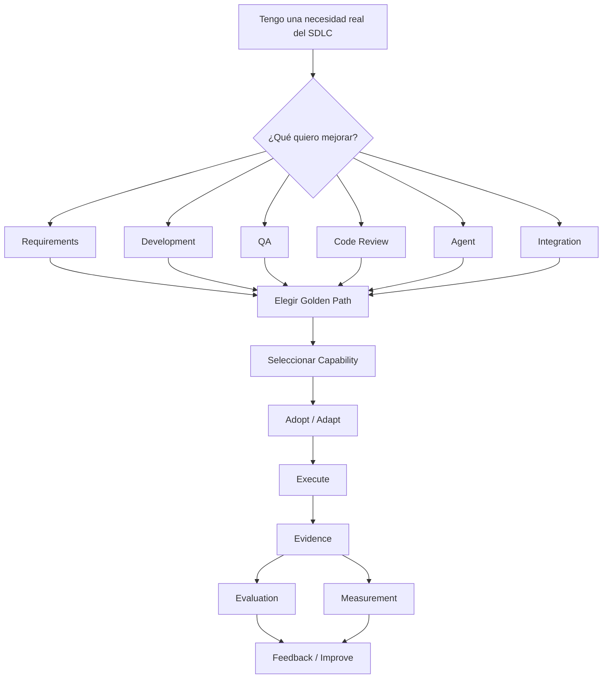

# Getting Started

## 0. Si eres nuevo, empieza aquí

Tenés un proyecto de MOA y querés usar IA para mejorar una actividad de tu SDLC. Esta
guía te lleva desde esa necesidad hasta un resultado trazable — sin necesitar que nadie
te explique el modelo primero.



## 1. Entender

`MOA-AI-Engineering` es la base común de AI Engineering para MOA — principios, gobierno,
un Registry de capacidades reales, Golden Paths, y contratos para generar evidencia,
evaluar y medir.

**Qué NO es**: no es un framework obligatorio, no es una plataforma que reemplaza tu
stack, no es un tutorial de cómo usar Copilot/Claude. **No necesitás copiar todo este
repositorio dentro de tu proyecto** — adoptás las capacidades puntuales que necesitás, el
resto queda acá como referencia.

## 2. Elegir qué quiero mejorar

| Necesidad | Camino recomendado |
|---|---|
| Refinar requerimientos | AI-Assisted Requirements |
| Desarrollar con IA | AI-Assisted Development |
| Generar/validar pruebas | AI-Assisted QA |
| Revisar código | AI Code Review |
| Crear un Agent | Agent Creation |
| Integrar un sistema externo | MCP / Integration Onboarding |

Detalle completo de cada camino: [`../golden-paths/README.md`](../golden-paths/README.md).
**Solo el primero (AI-Assisted Requirements) tiene ejecuciones reales hoy** — los demás
son conceptuales, documentados a propósito pero sin evidencia de ejecución todavía.

## 3. Elegir una capability

No son lo mismo:

```
Golden Path
    ↓
Capability
    ↓
Team Adaptation
    ↓
Project Execution
```

- **Golden Path** = cómo resolver una actividad (el camino, la secuencia).
- **Capability** = el activo reutilizable concreto que usás dentro del camino (una Skill,
  un Agent, un Workflow, una Instruction).
- **Execution** = aplicar esa capability sobre tu proyecto real, una vez.

Ver el catálogo completo: [`../registry/INDEX.md`](../registry/INDEX.md) (discovery, con
evidencia) o [`../capabilities/README.md`](../capabilities/README.md) (archivos listos
para copiar).

## 4. Evaluar antes de adoptar

Abrí la entrada completa en `../registry/entries/<nombre>.md`. Mirá, sin asumir que uno
responde al otro:

- **Risk** — riesgo declarado de la capability.
- **Data Classification** — qué datos toca (`REQUIRES VALIDATION` en las 6 hoy — política
  formal pendiente).
- **Configuration Status** — ¿el archivo está bien armado?
- **Real Use Status** — ¿alguien lo usó de verdad, o solo existe configurado?
- **Corporate Standard** — siempre `N` hoy; ninguna capability es estándar impuesto.
- **Evidence / Evaluation / Measurement** — referencias a ejecuciones reales, si existen.

**`Configuration Status` ≠ `Real Use Status`.** Que el archivo esté bien escrito no
significa que alguien lo haya ejecutado. Son preguntas independientes — ver
[`../architecture/capability-registry.md`](../architecture/capability-registry.md).

## 5. Adoptar / Adaptar

1. Abrí la capability elegida (`capabilities/<tipo>/<nombre>/`).
2. Leé su propósito.
3. Leé cuándo usarla y cuándo NO usarla.
4. Identificá la entrada que necesita (qué le vas a dar).
5. Identificá la salida que produce (qué vas a obtener).
6. Copiá/adoptá su estructura en el mecanismo de IA que use tu equipo (`.github/skills/`,
   `.github/agents/`, u otro — ver el mapeo en
   [`../capabilities/README.md`](../capabilities/README.md)).
7. Adaptá el contenido de dominio (roles, ejemplos, reglas de tu contexto real).
8. **No modifiques los contratos comunes** (Evidence/Evaluation/Measurement, formato de
   la capability) — eso es Common Core, no Team Adaptation.

Qué podés cambiar libremente y qué no, con más detalle:
[`team-adaptation.md`](team-adaptation.md).

## 6. Ejecutar

Ejecutar significa **aplicar la capability a una actividad real de tu SDLC** — nunca a un
ejemplo inventado para "probar el sistema".

```
Entrada real → capability → asistente IA → resultado → revisión humana
```

**Ejemplo genérico**: tenés un ticket real (`MOA-XXXX`). Le das al asistente el contenido
de la capability (ej. CAP-002 `user-story`) más el requerimiento real del ticket. El
asistente produce un resultado estructurado. Una persona con criterio de negocio lo
revisa antes de que avance a la siguiente etapa del SDLC.

La herramienta concreta puede ser **Copilot, Claude, u otro asistente compatible con tu
equipo** — `MOA-AI-Engineering` define el patrón y los controles, no obliga a un
proveedor (ver Blocked Decision #2, sin plataforma única sancionada por MOA).

Detalle operativo completo, paso a paso: [`execution-model.md`](execution-model.md).

## 7. Generar Evidence

**Evidence demuestra que una ejecución ocurrió** — en lenguaje simple: es la prueba, no
la opinión sobre si salió bien (eso es Evaluation).

- **Qué archivo usar**: [`templates/evidence-record.md`](templates/evidence-record.md).
- **Qué registrar**: quién ejecutó, cuándo, con qué capability y versión, sobre qué
  input, qué output produjo.
- **Qué NO registrar**: secretos, credenciales, ni el contenido completo de datos
  sensibles — usá referencias (paths, links, IDs).
- **Cómo enlazar el ticket/artefacto**: en el campo `input_reference` — un link real, no
  una descripción parafraseada.
- **Cómo enlazar Evaluation/Measurement**: en los campos `evaluation_reference` y
  `metric_reference` — `NOT EVALUATED`/`NOT MEASURED` si todavía no existen.

Contrato canónico completo:
[`../architecture/evidence-evaluation-measurement.md`](../architecture/evidence-evaluation-measurement.md#1-evidence).
Ejemplos reales ya hechos: [`../evidence/README.md`](../evidence/README.md).

## 8. Evaluar

- **Evidence** responde: *¿qué ocurrió?*
- **Evaluation** responde: *¿el resultado es correcto/suficiente?*

Los criterios se definen **antes** de mirar el resultado, no después. El resultado es
`PASS` / `PARTIAL` / `FAIL`, siempre con `rationale` (justificación) — nunca sin
explicar por qué.

**HITL es obligatorio** cuando el resultado puede promoverse o tener impacto real —
`method: model-assisted` (autoevaluación) no sustituye una evaluación humana
independiente, sin excepción.

Plantilla: [`templates/evaluation-record.md`](templates/evaluation-record.md). Ejemplos
reales: [`../evaluation/README.md`](../evaluation/README.md).

## 9. Medir

**Measurement responde**: *¿qué impacto tuvo?*

- Si existe baseline real: `confidence/status: MEASURED`, con `value` y `unit` reales.
- Si no existe: `NOT MEASURED` / `NO DATA`, con `baseline_reference: REQUIRES
  VALIDATION` — un resultado válido, no una falla.

**Nunca inventes un `0` ni un porcentaje de mejora** para completar el campo.

Plantilla: [`templates/measurement-record.md`](templates/measurement-record.md).
Ejemplos reales: [`../measurements/README.md`](../measurements/README.md).

## 10. Feedback / Improve

Si encontraste algo que valdría la pena que otros equipos usen, o una brecha en la
capability misma (contenido faltante, rol no cubierto, gap real) — convertilo en
feedback concreto siguiendo [`contribution-guide.md`](contribution-guide.md). El
mecanismo está listo; el receptor con mandato formal todavía depende de
[`../governance/BLOCKED-DECISIONS.md`](../governance/BLOCKED-DECISIONS.md) #1 — igual
vale la pena dejarlo trazable.

## 11. Definition of Done

```
[ ] Necesidad SDLC identificada
[ ] Golden Path identificado
[ ] Capability seleccionada
[ ] Capability adaptada
[ ] Actividad real ejecutada
[ ] Resultado generado
[ ] Evidence registrado
[ ] Evaluation registrado
[ ] HITL realizado cuando corresponde
[ ] Measurement registrado o declarado NOT MEASURED/NO DATA
[ ] Feedback registrado
```

## 12. Errores que debes evitar

- No copiar todo el repositorio dentro de tu proyecto.
- No asumir que **existir = funcionar**.
- No asumir que `CONFIGURED` = `EXECUTED`.
- No asumir que `EXECUTED` = `VERIFIED`.
- No considerar una salida de IA como aprobada automáticamente — siempre HITL cuando
  corresponde.
- No inventar métricas.
- No inventar baseline.
- No declarar `Corporate Standard` — esa decisión no es tuya ni de esta guía.
- No modificar contratos comunes sin pasar por Assessment.
- No confundir **Golden Path** con **Capability** (sección 3).
- No confundir **Evidence** (qué ocurrió) con **Evaluation** (si es correcto).
- No confundir **Evaluation** (correctness) con **Measurement** (impacto).

## Ver también

- [`adoption-flow.md`](adoption-flow.md) — el modelo mental completo, en un solo lugar.
- [`execution-model.md`](execution-model.md) — el detalle operativo de "ejecutar".
- [`team-adaptation.md`](team-adaptation.md) — qué adaptar, qué no.
- [`contribution-guide.md`](contribution-guide.md) — feedback y contribución.
