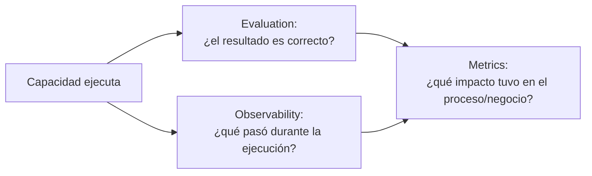

# Evaluation, Observability & Metrics

**Estado**: PROPOSAL. Complementa (no reemplaza)
[`../metrics/framework.md`](../metrics/framework.md) y
[`../metrics/kpis.md`](../metrics/kpis.md), que siguen siendo el catálogo de
métricas concretas propuestas por el KO. Este documento formaliza la **relación
arquitectónica** entre las 3 disciplinas — brecha que ninguno de los documentos previos
cubría explícitamente.

## Principio rector

> Evaluation ≠ Observability ≠ Metrics (Principio #9). Cada una responde una pregunta
> distinta y ninguna sustituye a las otras.



Una capacidad puede estar bien evaluada (outputs correctos en pruebas) y aun así no tener
observabilidad (no se sabe qué hizo en producción) ni impacto medido (no se sabe si
cambió algo del negocio). Ejemplo real de esta brecha: los 4 Agents de Orquestador
(`feature/cardless4`) tienen diseño cuidadoso (personalidad, constraints, HITL explícito)
que sugiere que *deberían* producir resultados correctos, pero no hay evidencia de
Evaluation real, cero Observability, y cero Metrics — las 3 columnas están vacías
simultáneamente.

## 0. Modelo de ejecución: local vs. común (PROPOSAL — agregado en G3.3 Corrections)

**No es una decisión corporativa** — es una aclaración de diseño necesaria para que
Evaluation/Observability no violen el principio de autonomía de equipo ya vigente
(`operating-model.md`, Principios #10 "Common Core ≠ centralizar todo" y #11 "team
autonomy debe preservarse"). Queda marcada PROPOSAL / REQUIRES VALIDATION donde
corresponda, no como norma ratificada.

**Regla propuesta**: Evaluation y Observability se **ejecutan en el contexto/localidad del
equipo** cuando sea técnicamente viable — no se impone una plataforma centralizada
obligatoria. El Common Core no ejecuta la evaluación por el equipo; **provee**:

- **Standards** — qué se considera una evaluación válida (`capability-model.md`,
  Cross-Cutting Concerns).
- **Patterns** — cómo estructurar una Human Evaluation, qué señales de Observability
  importan (secciones 1 y 2 de este documento).
- **Reusable tooling** — si en el futuro existe (no hay ninguna herramienta de este tipo
  implementada todavía).
- **Contracts** — el formato en el que un equipo reporta resultados (los campos
  `Evaluation Status` / `Observability Status` de `capability-registry.md`).
- **Reporting interfaces** — el mecanismo por el cual el resultado (no la ejecución en sí)
  llega al Registry central.

Es decir: **la ejecución es local, el resultado/metadata se reporta a un mecanismo
común** — el equipo no depende de una plataforma centralizada para poder evaluar u
observar su propia capacidad, pero sí existe un contrato común de cómo reportar lo que
encontró.

**Para Metrics, la tensión es distinta y se nombra explícitamente**: la
recolección/ejecución puede permanecer distribuida (cada equipo mide en su propio
contexto, como ya hace `moa-metrics` sobre datos de varios repos), **pero el modelo de
medición necesita suficiente consistencia común para permitir comparabilidad
transversal** — sin definiciones compartidas de qué cuenta como "HU refinada" o
"requerimiento", ningún dato es comparable entre DataAgro y Scato Logística. Esta es una
tensión real y esperable entre **team autonomy** y **common measurement model**, no un
error de diseño — se nombra acá para que no quede implícita, tal como ya la anticipaba
`operating-model.md` sin resolverla del todo.

**Qué NO define este documento todavía**: qué herramienta concreta implementa el
"reporting interface" — eso es una decisión tecnológica diferida, fuera de alcance de
G3.3.

## 1. Evaluation

**Responde**: ¿la capacidad produce el resultado esperado?

| Tipo | Cuándo aplica | Evidencia real en MOA |
|---|---|---|
| Deterministic tests | Capacidades con salida verificable exactamente (ej. un Workflow que genera código que debe compilar) | NOT FOUND como práctica formal |
| Scenario tests | Casos de uso concretos con resultado esperado conocido | NOT FOUND |
| Regression | Verificar que un cambio no rompe comportamiento previo | NOT FOUND para capacidades de IA (sí existe para código: NUnit/tests en varios repos, pero eso evalúa el código generado indirectamente, no la capacidad de IA en sí) |
| Human evaluation | Revisión humana estructurada del output | El más cercano a lo real: roles `reviewer`/`security-reviewer` de `moa-sdlc`, QA manual de `MOA-1765` (sin sign-off) |
| Agent/tool-use evaluation | ¿El agente eligió la herramienta/acción correcta? | NOT FOUND — ningún repo registra si un Agent usó bien sus `tools` |
| Acceptance criteria | Criterios explícitos de éxito, definidos antes de ejecutar | Existen para features de negocio (Given/When/Then en `user-story`) — **no existen para capacidades de IA mismas** |

**Regla de esta fase**: no crear datasets artificiales de evaluación sin un caso real que
lo justifique (instrucción explícita de alcance). El primer paso realista, cuando exista
mandato para avanzar, es **Human Evaluation estructurada** sobre las capacidades ya
`Pilot` (`lifecycle.md`) — es lo único que no requiere infraestructura nueva.

## 2. Observability

**Responde**: ¿qué ocurrió durante la ejecución?

| Señal | Por qué importa | Evidencia real |
|---|---|---|
| Execution (se ejecutó, cuándo) | Base mínima — sin esto no hay las demás | NOT FOUND |
| Tool calls (qué herramientas invocó) | Crítico para Agents con `tools: execute`/`edit` | NOT FOUND |
| Errors | Detectar fallos silenciosos | NOT FOUND |
| Latency | Detectar degradación | NOT FOUND |
| Model (qué modelo respondió) | Trazabilidad si hay más de un proveedor/modelo (ver Blocked Decision #2) | NOT FOUND |
| Token/cost | Control de costo | NOT FOUND |
| State transitions | Para Workflows con estado (`_sdd/`) | Parcial — `feature.json` de `_sdd/` registra estado, pero es manual, no instrumentado automáticamente |
| Traceability | Reconstruir una ejecución completa después del hecho | NOT FOUND |

**Regla de esta fase**: no implementar todavía una plataforma de observabilidad sin
decisión tecnológica (instrucción explícita de alcance). Este documento define **qué**
señales importan, no **con qué herramienta** capturarlas.

**Prioridad de esta brecha**: alta específicamente para cualquier capacidad con `tools:
execute` o `tools: edit`, y **crítica** para los hallazgos de MCP de
[`../security/security-governance.md`](../security/security-governance.md) — sin
Observability, no hay forma de confirmar si el MCP de Atlassian o el de Azure DevOps
encontrados se ejecutaron alguna vez.

**Nota agregada al implementar Context Acquisition & Resolution**: los 2 patrones nuevos
de Context Provider (CAP-007, CAP-008) dejan **preparados**, no instrumentados, los campos
`retrieval_status` y `provenance` del Resolved Context Contract
([`context-acquisition-resolution.md`](context-acquisition-resolution.md)) — cubren
directamente las señales "Execution" y "Errors" de la tabla de arriba para el caso
específico de adquisición de contexto, y `Action Type` (`security-governance.md` §1.5) es
la señal equivalente a "Tool calls" para distinguir READ de ACT. No se rediseña el modelo
de Observability — se confirma que ya tiene dónde encajar esto.

## 3. Metrics

**Responde**: ¿qué impacto produce en el proceso o negocio?

Categorías vigentes (sin cambios, ver `../metrics/framework.md`): Adoption,
Productivity, Quality, Delivery, Automation, Developer Experience, Business Impact.

**Regla explícita de G3.3**: la cantidad de Agents/Skills creados **no es un KPI de
éxito** — es, a lo sumo, una métrica de `Automation`/`Adoption` de la capacidad de
construir capacidades, no de su valor.

### Tratamiento de los 8 indicadores de `moa-metrics`

No se redefinen automáticamente como estándar corporativo:

```
STRONG CANDIDATE → ASSESS → VALIDATE → PROMOTE
```

Están en **STRONG CANDIDATE**: implementados con tests, pipeline ETL real, cubren 6/7
categorías del framework — pero sin baseline real medido en producción (brecha heredada
desde el inicio, ver `../metrics/kpis.md`). Pasan a **ASSESS** cuando alguien los someta al
rubric de `assessment-gate.md`; a **VALIDATE** si el Solutions Architect confirma que
corren en producción con datos reales; a **PROMOTE** solo después de eso.

## 4. Relación entre las 3 y el resto del modelo

- Alimentan directamente los campos `Evaluation Status`, `Observability Status`,
  `Metrics` de `capability-registry.md`.
- Son 3 de las 14 dimensiones de `assessment-gate.md`.
- Determinan si una capacidad puede avanzar de `Pilot` a `Measure` en `lifecycle.md`.
- Ninguna capacidad relevada hasta G3.2.5 tiene las 3 disciplinas cubiertas
  simultáneamente — es la brecha más transversal de todo el relevamiento.
