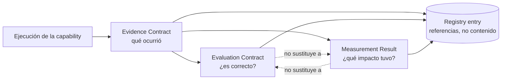

# Evidence, Evaluation & Measurement

**Estado**: PROPOSAL — modelo operativo vigente, sin decisión de gobierno formal que lo
ratifique como estándar corporativo. Aplicable hoy por cualquier equipo, sin esperar a
que se resuelvan las decisiones de `../governance/BLOCKED-DECISIONS.md`.

Este documento define los 3 contratos que sostienen la cadena de valor de cualquier
capacidad de AI Engineering en MOA:

```
AI capability → SDLC activity → resultado técnico/de negocio →
Evidence → Evaluation → Measurement → valor para MOA
```

Sin Evidence no hay Evaluation ni Measurement posibles — es el insumo común. Evaluation y
Measurement son consumidores **independientes** de una misma Evidence, no secuenciales
entre sí: una capacidad puede tener Evaluation sin Measurement todavía, o viceversa.



## 1. Evidence

**Evidence ≠ Evaluation ≠ Observability ≠ Metrics.** Evidence es lo que se produce
**primero**: el registro tangible de que algo ocurrió, sobre el cual después se aplican
Evaluation (¿es correcto?), Observability (¿qué pasó exactamente?) y Metrics (¿qué
impacto tuvo?).

**Existence ≠ Quality ≠ Completeness** — 3 preguntas independientes, no se asume que un
archivo que existe es evidencia suficiente:
- **Existence**: ¿el artefacto existe? (verificable directamente).
- **Quality**: ¿el artefacto es correcto/bien formado? (requiere Evaluation, no se asume).
- **Completeness**: ¿cubre todo lo que debería cubrir? (requiere revisión humana o
  criterios explícitos, no se infiere de que "hay algo").

### Evidence Contract

Archivo versionado en git (mismo patrón de diseño que el Registry), **no una base de
datos**:

| Campo | Descripción | Obligatorio |
|---|---|---|
| `capability_id` | ID del Registry (ej. `CAP-002`) | Sí |
| `capability_version` | Hash/versión de la capacidad usada (ver `capability-registry.md`, campo `Version`) | Sí |
| `execution_id` | Identificador único de esta ejecución puntual | Sí |
| `executed_at` | Fecha/hora de ejecución | Sí |
| `actor` | Quién ejecutó — persona o "human+AI assistant" | Sí |
| `repository` | Repo donde se ejecutó | Sí |
| `branch` | Rama donde se ejecutó | Sí |
| `input_reference` | Referencia (no contenido embebido) al insumo — ej. link a un ticket | Sí, si aplica |
| `output_reference` | Referencia al artefacto producido | Sí |
| `evidence_reference` | Referencia a este mismo registro (auto-referencia para trazabilidad desde el Registry) | Sí |
| `evaluation_reference` | Referencia al Evaluation Record correspondiente, si existe | No — puede ser `NOT EVALUATED` |
| `metric_reference` | Referencia al Measurement Result correspondiente, si existe | No — puede ser `NOT MEASURED` |
| `status` | `EXECUTED` / `PARTIAL` / `FAILED` | Sí |

**Regla de datos**: no se almacenan secretos, credenciales, ni contenido sensible
innecesario — solo referencias (paths, IDs, links), nunca el payload completo si es
sensible.

## 2. Evaluation

| Elemento | Definición |
|---|---|
| **Evaluation Criteria** | Qué se considera "correcto" — declarado ANTES de evaluar, no inventado después |
| **Evaluation Method** | `human` / `deterministic` / `automated` / `model-assisted` |
| **Evaluator** | Quién/qué realizó la evaluación — `REQUIRES VALIDATION` si no hay evaluador confirmado |
| **Evaluation Result** | `PASS` / `FAIL` / `PARTIAL`, con justificación |
| **Evaluation Date** | Cuándo se evaluó |
| **Evaluation Evidence** | Referencia al `evidence_reference` que se evaluó — la evaluación siempre evalúa una evidencia concreta, nunca "la capacidad en general" |

**No se asume que una evaluación automática es suficiente**: `automated`/`model-assisted`
es válido para señales de bajo riesgo, pero **HITL es obligatorio** cuando el resultado
puede habilitar una promoción real (`Corporate Standard: Y`) o cualquier acción con
impacto en producción.

### Evaluation Contract

| Campo | Descripción | Obligatorio |
|---|---|---|
| `capability_id` | ID del Registry | Sí |
| `evidence_reference` | Qué evidencia se evaluó | Sí |
| `criteria` | Lista de criterios aplicados | Sí |
| `method` | `human` / `deterministic` / `automated` / `model-assisted` | Sí |
| `evaluator` | Persona/mecanismo — `REQUIRES VALIDATION` si no confirmado | Sí (aunque sea REQUIRES VALIDATION) |
| `result` | `PASS` / `FAIL` / `PARTIAL` | Sí |
| `rationale` | Justificación del resultado | Sí |
| `evaluated_at` | Fecha | Sí |
| `hitl_required` | `true`/`false` — si esta evaluación requería validación humana | Sí |
| `hitl_confirmed_by` | Quién confirmó, si `hitl_required = true` | Sí si aplica |

## 3. Measurement

**Mecanismo elegido**: cuando la capacidad y el equipo ya están cubiertos por
`moa-metrics` (ver `../metrics/kpis.md`), el `source` del Measurement Result apunta ahí.
Cuando no, el equipo completa un **Measurement Result** como archivo versionado en su
propio repo o en `measurements/` — mismo contrato, mismo formato, sin esperar acceso a
infraestructura ajena. El mecanismo es "llenar un archivo con un schema fijo", no una
herramienta nueva.

### Measurement Result Contract

| Campo | Descripción | Regla |
|---|---|---|
| `capability_id` | ID del Registry | Obligatorio |
| `capability_version` | Versión medida | Obligatorio |
| `metric_id` | ID de la métrica (si coincide con una de `../metrics/framework.md`, se reutiliza; si es nueva, se declara) | Obligatorio |
| `metric_name` | Nombre legible | Obligatorio |
| `metric_definition` | Cómo se calcula, en una frase verificable | Obligatorio — sin definición clara, no es una métrica, es una opinión |
| `value` | El valor medido | Obligatorio si `status = MEASURED` |
| `unit` | Unidad (%, horas, cantidad, etc.) | Obligatorio si hay `value` |
| `period` | Ventana de tiempo que cubre la medición | Obligatorio |
| `baseline_reference` | A qué se compara — `REQUIRES VALIDATION` si no existe baseline | Obligatorio (aunque sea REQUIRES VALIDATION) |
| `source` | `moa-metrics` (referencia) o `local measurement` (con quién/cómo) | Obligatorio |
| `calculation_reference` | Cómo se llegó al valor — link a query, o descripción del conteo manual | Obligatorio |
| `measured_at` | Fecha | Obligatorio |
| `owner` | Quién es responsable del dato — `REQUIRES VALIDATION` si no confirmado | Obligatorio (aunque sea REQUIRES VALIDATION) |
| `confidence/status` | `MEASURED` / `NOT MEASURED` / `NO DATA` | Obligatorio |

**Reglas duras, sin excepción**:
- Si no existe medición real: `NOT MEASURED` o `NO DATA` — **nunca `0`** (un `0` implica
  que se midió y el resultado fue cero; `NOT MEASURED` implica que no se hizo la medición
  — son afirmaciones distintas, no intercambiables).
- Si no existe baseline: `baseline_reference: REQUIRES VALIDATION` — no se inventa un
  baseline para poder calcular un porcentaje de mejora.

## 4. Registry Integration

El Registry no es un repositorio de artefactos — cada entrada de `../registry/entries/`
tiene 3 campos de **referencia** (no de contenido): `Evidence Reference`, `Evaluation
Reference`, `Metric Reference`. Cuando no hay ejecución real, quedan honestamente en
`NOT EXECUTED` / `NOT EVALUATED` / `NOT MEASURED` — nunca inventados.

## 5. Registros reales existentes

4 registros de ejecución real aplicaron (o intentaron aplicar) estos 3 contratos, ninguno
simulado — ver [`../evidence/README.md`](../evidence/README.md),
[`../evaluation/README.md`](../evaluation/README.md) y
[`../measurements/README.md`](../measurements/README.md) para el detalle completo de cada
uno:

- **`EXEC-20260908-002`** — `BLOCKED`. Intento histórico de Connected Context (Jira) vía
  REST (Prioridad 2, sin MCP/credenciales disponibles en ese entorno). Preservado tal
  cual como evidencia histórica — **no convertido en éxito**.
- **`EXEC-20260908-003`** — `EXECUTED`. Azure DevOps → Resolved Context (CAP-007) →
  CAP-002, primer vertical slice real de punta a punta.
- **`EXEC-20260908-004`** — `EXECUTED`. Jira real → Atlassian Rovo MCP → `getJiraIssue` →
  Resolved Context (CAP-008) → CAP-002, sobre un issue real tipo Error/Bug
  (`ARMOA277-191`).
- **`EXEC-20260908-005`** — `EXECUTED`. Jira real → Atlassian Rovo MCP → `getJiraIssue` →
  Resolved Context (CAP-008) → CAP-002, sobre un segundo issue real tipo Tarea/Task
  (`ARMOA277-180`), sin descripción cargada.

**Para CAP-008 (`jira-context`) en particular**: 3 registros de ejecución relacionados —
1 `BLOCKED` (`EXEC-20260908-002`) y 2 `SUCCESS` (`EXEC-20260908-004`,
`EXEC-20260908-005`). Existe evidencia inicial de generalización a dos tipos de issue
reales con diferente nivel de completitud de información. `Real Use Status` continúa
siendo `EXECUTED` — **no se declara `VERIFIED`**: la validación humana independiente
sigue pendiente, y el Measurement de las 4 ejecuciones continúa `NOT MEASURED` porque
todavía no existe baseline cuantitativo.

## Historial

El razonamiento completo detrás de este modelo (alternativas de medición evaluadas y
descartadas, justificación de cada decisión) está preservado en
[`../docs/history/track-1/G4.3-Evidence-Evaluation-Measurement.md`](../docs/history/track-1/G4.3-Evidence-Evaluation-Measurement.md).
