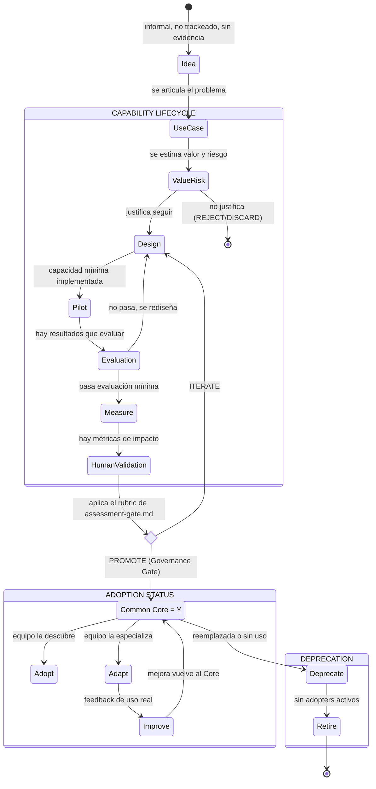

# Capability Lifecycle

**Estado**: PROPOSAL. No confundir con `../strategy/maturity-model.md`
(Crawl/Walk/Run) — ese modelo mide la madurez de un **equipo**; este documento modela el
ciclo de vida de una **capacidad individual** (un Agent, un Skill, una Instruction). Son
ejes complementarios, no intercambiables.

## Propósito

Formalizar cómo una capacidad nace, se valida, se promueve (o no), y eventualmente se
retira — de forma que el estado de cualquier capacidad sea siempre explícito y consultable
(ver `capability-registry.md`, campo `Lifecycle State`).

## Estructura corregida (G3.3 Corrections)

La revisión final de consistencia encontró 2 problemas estructurales en el modelo
original: `Idea` no es un estado trackeable (no requiere ni genera evidencia), y `Common
Core` estaba modelado como un paso secuencial único cuando en realidad es un **flag de
estado** — una vez alcanzado, varios equipos pueden estar en Adopt/Adapt/Improve **en
paralelo**, no en fila. Se corrige separando el modelo en 3 bloques:

```text
Idea (informal, fuera del lifecycle formal)
    ↓ se articula
CAPABILITY LIFECYCLE (secuencial, con evidencia en cada paso)
    Use Case → Value+Risk → Design → Pilot → Evaluation → Measure → Human Validation → Promote
                                                                              │
                                                              Promote = decisión / Governance Gate
                                                              (no un estado prolongado — es el
                                                              punto donde se aplica el rubric de
                                                              assessment-gate.md)
                                                                              ↓ PROMOTE
ADOPTION STATUS (no secuencial — status + acciones en paralelo por N equipos)
    Common Core = Y/N  →  Adopt · Adapt · Improve (cualquier combinación, cualquier equipo, en paralelo)
                                                                              ↓ reemplazada o sin uso
DEPRECATION (secuencial)
    Deprecate → Retire
```

## El ciclo



## Estados

### Idea (pre-lifecycle, no trackeado)

`Idea → Use Case` es informal — sin artefacto, sin evidencia requerida, y **no se registra
como entrada de `capability-registry.md`**. Es el punto de partida conceptual, no un
estado del lifecycle formal.

### Capability Lifecycle (secuencial, con evidencia en cada paso)

| Estado | Qué significa | Quién lo mueve | Evidencia mínima requerida |
|---|---|---|---|
| **Use Case** | El problema está articulado como caso de uso concreto (ver `../templates/use-case-template.md`) | Equipo proponente | Documento de caso de uso |
| **Value + Risk** | Se estimó el valor esperado y el riesgo (ver `assessment-gate.md`, dimensiones Value/Risk) | Equipo proponente | Estimación explícita, no implícita |
| **Design** | Se seleccionó la capacidad adecuada (`capability-model.md`) y se diseñó — **sin implementación productiva todavía** | Equipo proponente | Diseño documentado |
| **Pilot** | Implementación mínima, en un contexto acotado y real | Equipo proponente | Al menos 1 ejecución real |
| **Evaluation** | Se verificó que produce el resultado esperado (`evaluation-observability.md`) | Equipo proponente | Resultado de evaluación, no solo "funcionó una vez" |
| **Measure** | Se midió impacto real en el proceso (`evaluation-observability.md`, sección Metrics) | Equipo proponente + Common Core (si aplica métrica común) | Dato de métrica, no proyección |
| **Human Validation** | Una persona con mandato revisó evidencia y decidió explícitamente | **REQUIRES VALIDATION quién tiene este mandato** (Blocked Decision #1) | Decisión registrada, no implícita |
| **Promote** | **Decisión / Governance Gate — no un estado prolongado.** Es exactamente el punto donde se aplica el rubric de `assessment-gate.md` (ADOPT/ADAPT/TEAM-SPECIFIC/VALIDATE/REJECT); el resultado del Gate determina si se avanza a `Common Core = Y` o se vuelve a Design | Solutions Architect (aprobación final) | Resultado del Assessment Gate |

### Adoption Status (no secuencial — status + acciones en paralelo)

| Estado/Status | Qué significa | Quién lo mueve | Evidencia mínima requerida |
|---|---|---|---|
| **Common Core = Y/N** | Flag, no paso de fila — indica si la capacidad está disponible para cualquier equipo. Una vez `Y`, **múltiples equipos pueden estar en Adopt/Adapt/Improve simultáneamente**, no en secuencia | Resultado de `Promote` | Entrada en `capability-registry.md`, campo `Corporate Standard = Y` |
| **Adopt** | Un equipo la descubre y decide usarla tal cual | Equipo consumidor | Registro en `Adopters` (Registry) |
| **Adapt** | Un equipo la especializa para su contexto, sin modificar el Common Core | Equipo consumidor | Ídem |
| **Improve** | Feedback de uso real genera una mejora que vuelve al Core | Equipo consumidor → Common Core | Propuesta de mejora, re-entra al ciclo desde Design o Pilot según alcance |

### Deprecation (secuencial)

| Estado | Qué significa | Quién lo mueve | Evidencia mínima requerida |
|---|---|---|---|
| **Deprecate** | La capacidad fue reemplazada o dejó de tener uso real | Common Core (con evidencia, no por antigüedad) | Justificación explícita |
| **Retire** | Sin adopters activos, se retira del Registry como activa | Common Core | Confirmación de cero uso real |

## Reglas duras

1. **Ninguna capacidad salta etapas.** Antigüedad, tamaño del equipo que la propone, o
   "ya lo usamos hace tiempo" no son criterios de promoción (Principio #13).
2. **Configuration ≠ Real Use ≠ Process Maturity ≠ Results** (Principio #1) — un artefacto
   puede tener `Lifecycle State = Pilot` durante meses si nunca pasó por Evaluation real,
   independientemente de qué tan bien escrito esté. Ejemplo real: los Agents de
   Orquestador (`feature/cardless4`) tienen configuración VERIFIED de alta calidad, pero
   sin evidencia de Evaluation/Measure — su estado real en este modelo es **Pilot**, no
   más avanzado, hasta que exista esa evidencia.
3. **Origin ≠ Ownership ≠ Adoption ≠ Standardization** (Principio #2) — que una capacidad
   haya sido originada por una persona/equipo no le da automáticamente más derecho a
   convertirse en estándar que una originada por otro. El hallazgo de G3.2.5 (autoría
   concentrada en pocas personas de Baufest detrás de la mayoría de la evidencia real) es
   la razón concreta por la que esta regla se explicita acá.
4. **Retirement no es fallo** — una capacidad puede completar su ciclo útil y retirarse
   sin que eso invalide el trabajo previo.

## Estado real de las capacidades ya relevadas (aplicando este modelo)

| Capacidad | Estado en este modelo | Por qué |
|---|---|---|
| Patrón AGENTS.md + Agents + Skills + Instructions (DataAgro) | **Pilot** | Configuración madura, sin Evaluation/Measure documentados |
| Ídem (Scato Logística) | **Pilot** (más integrado que DataAgro, mismo estado formal) | Ídem |
| Ídem (Orquestador, `feature/cardless4`) | **Pilot** — con matiz: nunca llegó a integrarse a `master` | Configuración madura + 1 evidencia de uso real el mismo día de creación (skill `abm-mvc`) — el caso más avanzado encontrado, pero igual sin Evaluation/Measure formales |
| `moa-sdlc` (harness SDD, `AGENTS-CONTRACTS.md`) | **Pilot**, con 1 caso real (`MOA-1765`) sin cerrar (sin QA sign-off) | No completó Evaluation/Measure |
| 8 indicadores de `moa-metrics` | **Measure** (el más avanzado del relevamiento) — pero sin baseline real (Blocked, ver `metrics/kpis.md`) | Implementados, con tests, pero sin evidencia de estar corriendo en producción con datos reales |

Ninguna capacidad relevada hasta G3.2.5 llegó a **Human Validation** ni **Common Core**
bajo este modelo.
