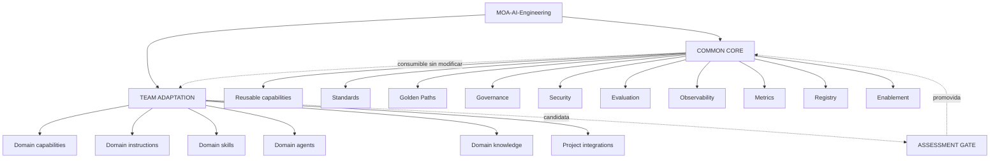
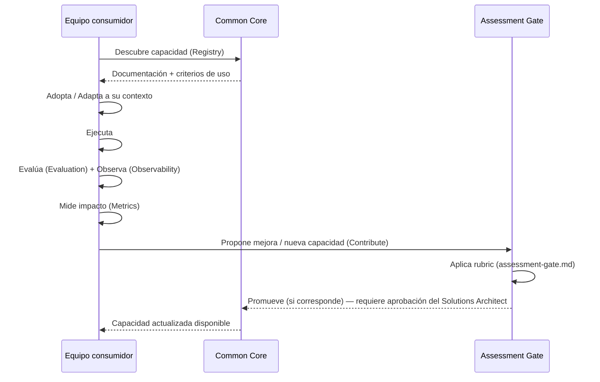

# Operating Model

**Estado**: PROPOSAL salvo donde se cita FACT explícitamente. Ver
[`../governance/BLOCKED-DECISIONS.md`](../governance/BLOCKED-DECISIONS.md) para las
preguntas que condicionan este documento (especialmente #1: quién gobierna el Common
Core).

## Propósito

Definir quién hace qué, con qué autonomía, y cómo una capacidad pasa de un equipo al
Common Core — sin asumir estructura organizacional no evidenciada.

## Principio rector

> Common Core ≠ centralizar todo. Team autonomy debe preservarse. (Principios
> arquitectónicos #10, #11 de G3.3)

MOA-AI-Engineering **no reemplaza** el trabajo de ningún equipo — es una capacidad de
soporte que un equipo puede consumir, adaptar, y a la que puede contribuir. El repositorio
`MOA-AI-Engineering` es la **implementación de referencia** de esa capacidad, no la
totalidad de la organización que la sostiene (esa organización — quién la financia, quién
la gobierna formalmente — sigue **REQUIRES VALIDATION**, ver Blocked Decision #1).

## Target Operating Model

## Las 3 capas

### 1. Common Core

**Qué es** (PROPOSAL, corrigiendo una imprecisión de la fase Foundation): una **capacidad
organizacional y técnica** — principios, gobierno, un pipeline de assessment, un modelo de
capacidades, patrones reusables, evaluación, observabilidad, métricas, un registro, y
enablement. El repositorio `MOA-AI-Engineering` es su base de referencia versionada, no su
totalidad — el Common Core también incluye procesos y personas que hoy **no están
evidenciados** (ver Blocked Decision #1).

**Responsabilidad**: mantener los 10 componentes listados arriba en un estado
consumible, versionado, y consistente entre sí (ver
[`../security/security-governance.md`](../security/security-governance.md),
`assessment-gate.md`, `capability-registry.md`, `evaluation-observability.md`,
[`../golden-paths/README.md`](../golden-paths/README.md)).

**Lo que el Common Core NO hace**: no impone tecnología, no reemplaza el criterio del
equipo, no aprueba automáticamente nada por existir en más de un repo (Principio #13,
ver `../strategy/principles.md`). **Tampoco impone una
plataforma centralizada obligatoria para Evaluation/Observability** (PROPOSAL, G3.3
Corrections — ver `evaluation-observability.md` §0): esas se ejecutan en el contexto local
del equipo cuando sea técnicamente viable; el Common Core provee standards, patterns,
reusable tooling, contracts y reporting interfaces, no la ejecución en sí. Para Metrics
existe una tensión real, nombrada explícitamente y no resuelta del todo: la
recolección puede permanecer distribuida, pero el modelo de medición necesita
consistencia común para que los datos sean comparables entre equipos — **team autonomy +
common measurement model**, no uno a costa del otro.

### 2. Team Adaptation

**Qué es**: el dominio, contexto, reglas específicas, skills/agents/instructions propios,
conocimiento e integraciones de cada equipo — exactamente lo que hoy existe de facto en
DataAgro, Scato Logística, Orquestador, y lo que existiría en cualquier equipo nuevo.

**Principio de consumo**: un equipo debe poder **consumir** el Common Core sin
modificarlo (ej. usar el formato de 4 capas — ver `capability-model.md` — sin que eso
implique tocar ningún archivo de otro repo). Esto ya es consistente con la evidencia real:
DataAgro, Scato Logística y Orquestador tienen implementaciones independientes del mismo
formato, cada una en su propio repo, sin dependencia de archivo compartido.

**Responsabilidad del equipo**: mantener sus propias capacidades vigentes, evaluarlas
antes de proponerlas, y decidir qué adopta del Common Core según su propio contexto de
riesgo y necesidad.

### 3. Assessment Gate

Ver [`assessment-gate.md`](assessment-gate.md) para el modelo completo. Es la única vía de
entrada de Team Adaptation a Common Core — no hay atajos por antigüedad, tamaño de equipo,
o repetición en varios repos (**Principio #13**, reforzado por el hallazgo de G3.2.5: la
convergencia entre DataAgro/Scato Logística/Orquestador resultó tener autoría concentrada
en pocas personas, no adopción distribuida independiente — razón adicional para no
promover automáticamente por "aparece en 3 repos").

## Roles (FACT donde está evidenciado, REQUIRES VALIDATION donde no)

Roles de gobierno y consumo del producto — no incluye roles del equipo que construyó
este repositorio (ver `docs/history/track-1/` para ese contexto, si es relevante).

| Rol | Responsabilidad declarada | Evidencia |
|---|---|---|
| **Solutions Architect / gobierno de la arquitectura** | Decisiones arquitectónicas, aprobación de promociones a Common Core | FACT |
| **Líderes de la iniciativa** | Elmer Charre, Fernando Pagano, Tito Picón (soporte: Adrián Bepré, Ariel Bensussán) | FACT — KO Interno pág. 17. **REQUIRES VALIDATION**: si tienen mandato de aprobación de gobierno (Blocked Decision #1) |
| **Practicantes identificados con evidencia real de AI Engineering** | Manuel Davila, Alexis Morales Vega, Gonzalo Sian — autores reales de la mayoría de Agents/Skills/Instructions encontrados en repos de MOA | FACT, por autoría de commits. **REQUIRES VALIDATION**: rol formal dentro de la iniciativa (Blocked Decision #5) |
| **Equipos consumidores** (DataAgro, MOA Operaciones, Scato Puerto, Scato Logística, Orquestador) | Adoptan, adaptan, ejecutan, evalúan, miden, contribuyen — ver [`../golden-paths/README.md`](../golden-paths/README.md) y el Adoption Test | FACT (existencia de los equipos) / REQUIRES VALIDATION (nivel de participación real más allá de los repos ya evidenciados) |

## Flujo de adopción (alto nivel)

## Relación con el resto de la documentación

- Modelo de capacidades usado en Team Adaptation y Common Core: [`capability-model.md`](capability-model.md).
- Cómo una capacidad transiciona de estado: [`lifecycle.md`](lifecycle.md).
- Cómo se decide una promoción: [`assessment-gate.md`](assessment-gate.md).
- Cómo se registra cada capacidad: [`capability-registry.md`](capability-registry.md).
- Controles aplicables en ambas capas: [`../security/security-governance.md`](../security/security-governance.md).
- Cómo se sabe si algo funciona y qué impacto tiene: [`evaluation-observability.md`](evaluation-observability.md).
- Caminos guiados de adopción: [`../golden-paths/README.md`](../golden-paths/README.md).
- Arquitectura lógica completa: [`reference-architecture.md`](reference-architecture.md).

Este documento no reemplaza `../strategy/vision.md`, `../strategy/principles.md` ni
`../teams/README.md` — los complementa con el modelo operativo formal.
