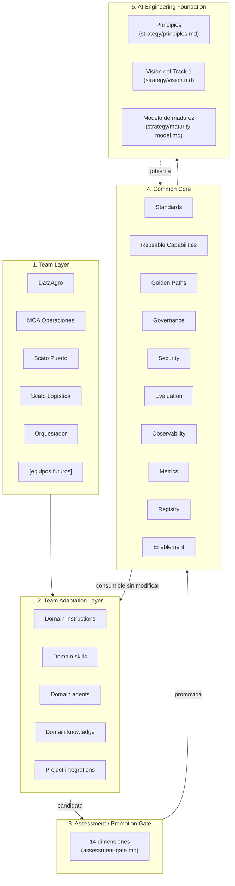
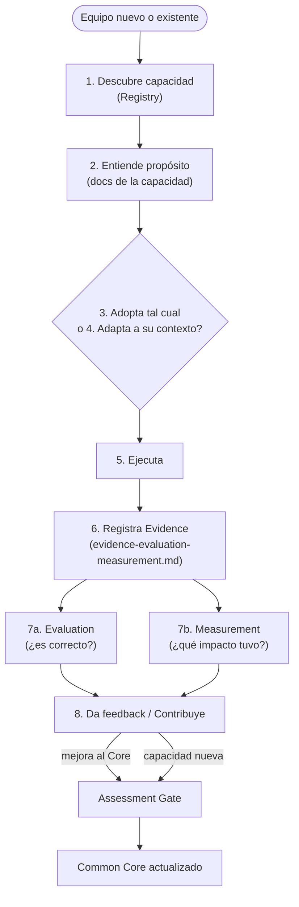

# Reference Architecture

**Estado**: PROPOSAL — arquitectura de referencia canónica y vigente de
`MOA-AI-Engineering`. Reemplaza y consolida la
[versión histórica de la fase Foundation](../docs/history/track-1/reference-architecture-g1-superseded.md)
— ese archivo se conserva por su contenido FACT todavía válido (stack del KO), pero no es
la referencia arquitectónica activa. Este documento conecta `operating-model.md`,
`capability-model.md`, `lifecycle.md`, `assessment-gate.md`, `capability-registry.md`,
[`../security/security-governance.md`](../security/security-governance.md),
`evaluation-observability.md` y [`../golden-paths/README.md`](../golden-paths/README.md)
en una sola arquitectura lógica.

**Provider-agnostic**: esta arquitectura no asume GitHub Copilot, Copilot Studio, Claude,
ni ningún proveedor como plataforma única (ver `capability-model.md`, Blocked Decision
#2). Puede tener implementaciones específicas por proveedor sin que el modelo cambie.

## Las 5 capas

### 1. Team Layer

**Qué es**: los equipos/servicios de MOA con evidencia real (`../teams/README.md`).
**Responsabilidad**: entregar valor de negocio en su dominio — no es responsabilidad de
este layer producir capacidades reusables (aunque puede hacerlo).
**Límite**: este layer no está gobernado por `MOA-AI-Engineering` — lo consume
opcionalmente.

### 2. Team Adaptation Layer

**Qué es**: las capacidades de IA específicas de cada equipo (`capability-model.md`),
vivan donde vivan (repo del equipo, no en `MOA-AI-Engineering`).
**Responsabilidad**: el equipo mantiene sus propias capacidades, decide qué consumir del
Common Core, y decide qué proponer para promoción.
**Límite**: nada de este layer se considera Common Core solo por existir, ni por existir
en más de un repo (Principio #13, reforzado por el hallazgo de autoría de G3.2.5).

### 3. Assessment / Promotion Gate

**Qué es**: el rubric de 14 dimensiones (`assessment-gate.md`), aplicado dentro del
pipeline de 11 pasos ya vigente (`../assessment/README.md`).
**Responsabilidad**: producir una clasificación razonada (ADOPT/ADAPT/TEAM-SPECIFIC/
VALIDATE/REJECT) con evidencia, nunca una promoción automática.
**Límite**: el Gate no aprueba nada por sí mismo — es insumo. La aprobación final es del
Solutions Architect (`operating-model.md`).

### 4. Common Core

**Qué es**: los 10 componentes ya definidos en `operating-model.md` — no es "todo
centralizado" (Principio #10), es la capacidad organizacional/técnica compartida.
**Responsabilidad**: mantener Standards, Reusable Capabilities, Golden Paths, Governance,
Security, Evaluation, Observability, Metrics, Registry y Enablement en estado consumible.
**Límite**: no impone tecnología ni reemplaza el criterio del equipo (`operating-model.md`).

### 5. AI Engineering Foundation

**Qué es**: la capa de principios y visión que gobierna todo lo anterior — ya existente
(`../strategy/`).
**Responsabilidad**: fijar el "por qué" (objetivo del Track 1) del que todo lo demás se
deriva. Si una decisión de cualquier capa inferior contradice esta capa, la Foundation
prevalece (ej.: cualquier propuesta de Common Core que implique "sumar herramientas" en
vez de "convertir el uso de IA en práctica sostenida de ingeniería" contradice
`../strategy/vision.md` y debe rechazarse).
**Límite**: esta capa no cambia con cada iteración técnica — solo con decisión explícita
del Solutions Architect/MOA.

## Interaction Surface / Channel (concepto, no implementado)

**PROPOSAL, agregado al evaluar Copilot Studio/"Mola"** (ver
[`benchmark-to-target-model-decision-input.md`](benchmark-to-target-model-decision-input.md)
Decisión #5). **No es una 8va capacidad** — es la superficie por la cual un resultado
llega a quien lo consume: IDE, CLI, Chat, Copilot, Copilot Studio, Web, API. Una misma
capability puede exponerse por más de una surface sin cambiar su contrato — el concepto
existe para que el modelo pueda **explicar** casos como un chatbot de producción
(Copilot Studio/"Mola", encontrado en el benchmark de prácticas reales) sin forzarlo
dentro de la taxonomía de 7 capacidades.

**Estado de "Mola" específicamente**: `REQUIRES VALIDATION` — no se declara estándar
corporativo, no se determina si está dentro del alcance de gobierno de Track 1
([`../evidence/current-moa-ai-practices-benchmark.md`](../evidence/current-moa-ai-practices-benchmark.md)
sección 16, gap 4). **No se implementa ningún Channel/Interface nuevo en esta actividad**
— este concepto queda documentado únicamente para que el modelo pueda nombrar lo que ya
existe, no como una capacidad a construir.

## Team Adoption Flow

Evaluation y Measurement son ramas **independientes** que consumen la misma Evidence —
no un paso secuencial único (`Execute → Evaluate → Measure`) — ver
[`evidence-evaluation-measurement.md`](evidence-evaluation-measurement.md) para el
contrato completo; una capacidad puede tener Evaluation sin Measurement todavía, o
viceversa.

Este flujo **es** el Adoption Test operacionalizado — ver sección "Fase 5" del reporte
final de G3.3 para la simulación conceptual de un equipo nuevo.

## Stack tecnológico actual (FACT — heredado de la fase Foundation, sin cambios)

| Categoría | Herramientas | Fuente |
|---|---|---|
| Repos de código | Azure DevOps | KO pág. 10 |
| Base de datos | SQL Server | KO pág. 10 |
| Requerimientos | Jira | KO pág. 10 |
| Documentación | SharePoint (MOA) + Confluence (Baufest, uso REQUIRES VALIDATION — Blocked Decision #8) | KO pág. 10 |
| Coding | Visual Studio + VS Code + GitHub Copilot | KO pág. 10 |
| Testing | NUnit, Cypress (parcial), JMeter (parcial), Playwright | KO pág. 10 |
| Asistencia IA | GitHub Copilot, Copilot Code Review, Rovo | KO pág. 15 |
| MCP real encontrado | `com.atlassian/atlassian-mcp-server` (Orquestador, rama no integrada, CONFIGURATION VERIFIED / REAL USE REQUIRES VALIDATION) | G3.2.5 |

## Qué NO incluye este documento

- Diagramas técnicos de despliegue/componentes de infraestructura.
- Decisiones de producto tecnológico concretas (qué plataforma de observabilidad, qué
  motor de Registry).
- Ninguna implementación — es arquitectura conceptual y lógica, alcance explícito de
  G3.3.
