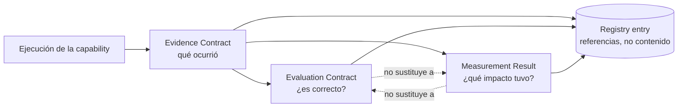

# G4.3 — Operational Evidence, Evaluation & Measurement

**Fase**: G4.3. **Estado**: PROPOSAL salvo citas FACT explícitas. Precondición: G4.2
CLOSED WITH CONDITIONS. No se creó infraestructura nueva, no se creó un segundo Golden
Path, no se modificó el repositorio de Orquestador (solo lectura), no se hizo commit/push,
no se avanzó a G4.4.

---

## 1. Executive Summary

G4.3 ataca las 2 condiciones que dejó G4.2: el bloqueo de `Measure` en el Adoption Test, y
la relación sin resolver entre las ramas de Orquestador. Para la primera, se define un
**Evidence Contract**, un **Evaluation Contract** y un **Measurement Result Contract** —
los 3 como archivos versionados en git (mismo patrón de diseño que el Registry de G4.2,
sin infraestructura nueva) — y se elige un mecanismo de medición híbrido (referencia a
`moa-metrics` cuando esté disponible + archivo local versionado cuando no) que resuelve el
bloqueo sin construir una plataforma. Para la segunda, la investigación con `git log`
encontró evidencia sólida y un hallazgo no anticipado: **hay al menos 2 consultoras
externas distintas (Baufest y "Huenei") contribuyendo al mismo repositorio de
Orquestador**, en líneas de ramas separadas — esto explica en gran medida por qué
`master` y `master-logistica` divergieron y nunca se reintegraron.

## 2. G4.3 Objective

Convertir Evidence → Evaluation → Measure en un mecanismo operativo mínimo y reutilizable,
sin construir una plataforma central.

## 3. G4.2 Findings Being Addressed

1. Adoption Test: paso "Measure" quedó **BLOCKED** — sin mecanismo accesible fuera de
   `moa-metrics`.
2. Relación real entre `master`/`master-logistica`/`master-merge` de Orquestador sin
   validar — Blocked Decision #11.

## 4. Current Gap Analysis

| Documento existente | Qué ya define | Qué falta (el gap que cierra G4.3) |
|---|---|---|
| `evaluation-observability.md` | Qué es Evaluation/Observability/Metrics, señales, categorías | Ningún **contrato estructurado** (schema) para capturar un resultado concreto — solo el modelo conceptual |
| `capability-registry.md` | Campos `Evaluation Status`, `Observability Status`, `Metrics` | Son campos de **estado** (VERIFIED/NOT FOUND/etc.), no una **referencia** a un registro real de evidencia/evaluación/medición |
| `golden-paths.md` / G4.2 Golden Path | Pasos "Evidence/Evaluate/Measure" nombrados | Sin definición operativa de qué contiene cada paso — es donde G4.2 se quedó corto (BLOCKED) |
| `metrics/framework.md`, `metrics/kpis.md` | Categorías y KPIs propuestos por el KO | No resuelven el caso de un equipo sin acceso a `moa-metrics` — G4.3 lo cubre explícitamente |

**No se reemplaza ningún modelo existente** — los 3 contratos de este documento son la
capa operativa que faltaba sobre lo ya definido.

## 5. Evidence Model

**Evidence ≠ Evaluation ≠ Observability ≠ Metrics** (principio nuevo de G4.3, consistente
con — no contradice — la distinción de 3 vigente desde G3.3). Evidence es lo que se
produce **primero**: el registro tangible de que algo ocurrió, sobre el cual después se
aplican Evaluation (¿es correcto?), Observability (¿qué pasó exactamente?) y Metrics
(¿qué impacto tuvo?).

**Tipos de Evidence** (no exhaustivo, PROPOSAL):

| Tipo | Ejemplo |
|---|---|
| Generated artifact | Una historia de usuario generada (Golden Path AI-Assisted Requirements) |
| PR | Un Pull Request abierto por o con asistencia de IA |
| Commit | Un commit generado/asistido |
| Test result | Resultado de una suite de tests |
| Review result | Comentarios de un code review (humano o asistido) |
| Requirement artifact | Un documento de requerimiento/criterios de aceptación |
| Evaluation record | El resultado de aplicar el Evaluation Contract (sección 7) |
| Metric result | El resultado de aplicar el Measurement Result Contract (sección 9) |

**Existence ≠ Quality ≠ Completeness** — 3 preguntas independientes, no se asume que un
archivo que existe es evidencia suficiente:

- **Existence**: ¿el artefacto existe? (verificable directamente, ej. el archivo está en
  el repo)
- **Quality**: ¿el artefacto es correcto/bien formado? (requiere Evaluation, no se asume)
- **Completeness**: ¿cubre todo lo que debería cubrir el caso de uso? (requiere revisión
  humana o criterios explícitos, no se infiere de que "hay algo")

## 6. Evidence Contract

Archivo versionado en git (mismo patrón de diseño que el Registry — Principio #5,
consistente con G4.1/G4.2), **no una base de datos**:

| Campo | Descripción | Obligatorio |
|---|---|---|
| `capability_id` | ID del Registry (ej. `CAP-002`) | Sí |
| `capability_version` | Hash/versión de la capacidad usada (ver `capability-registry.md`, campo `Version`) | Sí |
| `execution_id` | Identificador único de esta ejecución puntual | Sí |
| `executed_at` | Fecha/hora de ejecución | Sí |
| `actor` | Quién ejecutó — persona o "human+AI assistant" | Sí |
| `repository` | Repo donde se ejecutó | Sí |
| `branch` | Rama donde se ejecutó | Sí |
| `input_reference` | Referencia (no contenido embebido) al insumo — ej. link a un ticket de Jira | Sí, si aplica |
| `output_reference` | Referencia al artefacto producido | Sí |
| `evidence_reference` | Referencia a este mismo registro (auto-referencia para trazabilidad desde el Registry) | Sí |
| `evaluation_reference` | Referencia al Evaluation Record correspondiente (sección 7), si existe | No — puede ser `NOT EVALUATED` |
| `metric_reference` | Referencia al Measurement Result correspondiente (sección 9), si existe | No — puede ser `NOT MEASURED` |
| `status` | `EXECUTED` / `PARTIAL` / `FAILED` | Sí |

**Regla de datos**: no se almacenan secretos, credenciales, ni contenido sensible
innecesario — solo referencias (paths, IDs, links), nunca el payload completo si es
sensible. Ningún campo de este contrato requiere una decisión corporativa pendiente para
funcionar — es aplicable hoy, por cualquier equipo, sin esperar a `BLOCKED-DECISIONS.md`.

## 7. Evaluation Model

Modelo mínimo, distinto de Evidence y de Observability:

| Elemento | Definición |
|---|---|
| **Evaluation Criteria** | Qué se considera "correcto" — declarado ANTES de evaluar, no inventado después |
| **Evaluation Method** | `human` / `deterministic` / `automated` / `model-assisted` |
| **Evaluator** | Quién/qué realizó la evaluación — **REQUIRES VALIDATION si no hay evaluador confirmado** (ligado a Blocked Decision #1) |
| **Evaluation Result** | `PASS` / `FAIL` / `PARTIAL`, con justificación |
| **Evaluation Date** | Cuándo se evaluó |
| **Evaluation Evidence** | Referencia al `evidence_reference` que se evaluó — la evaluación siempre evalúa una evidencia concreta, nunca "la capacidad en general" |

**No se asume que una evaluación automática es suficiente** — el método `automated` o
`model-assisted` es válido para señales de bajo riesgo (ej. verificar formato), pero
**HITL es obligatorio** cuando el resultado de la evaluación puede habilitar una
promoción real (`Corporate Standard: Y`) o cualquier acción con impacto en producción —
consistente con el principio de human-in-the-loop ya vigente desde G1.

## 8. Evaluation Contract

| Campo | Descripción | Obligatorio |
|---|---|---|
| `capability_id` | ID del Registry | Sí |
| `evidence_reference` | Qué evidencia se evaluó | Sí |
| `criteria` | Lista de criterios aplicados | Sí |
| `method` | `human` / `deterministic` / `automated` / `model-assisted` | Sí |
| `evaluator` | Persona/mecanismo — `REQUIRES VALIDATION` si no confirmado | Sí (aunque sea REQUIRES VALIDATION) |
| `result` | `PASS` / `FAIL` / `PARTIAL` | Sí |
| `rationale` | Justificación del resultado | Sí |
| `evaluated_at` | Fecha | Sí |
| `hitl_required` | `true`/`false` — si esta evaluación requería validación humana | Sí |
| `hitl_confirmed_by` | Quién confirmó, si `hitl_required = true` | Sí si aplica |

## 9. Measurement Model — el gap principal de G4.2

**Alternativas evaluadas** (instrucción explícita de no crear plataforma nueva ni
duplicar `moa-metrics`):

| Alternativa | Evaluación |
|---|---|
| A. Referencia a `moa-metrics` existente | Válida cuando el equipo ya está cubierto por ese pipeline (Jira/ADO/Copilot/SonarQube) — pero **no se puede asumir disponible para todos** (ya confirmado: MOA Operaciones, Scato Puerto, Orquestador no tienen evidencia de estar conectados) |
| B. Medición local por capability/equipo, sin estructura | Rechazada — sin contrato común, no hay comparabilidad (viola "common measurement model") |
| C. Archivo de measurement result versionado, con contrato común | Cumple team autonomy (cualquiera puede crearlo sin infraestructura) + common measurement model (mismo schema para todos) |
| D. Combinación de A + C | **Seleccionada** |
| E. Otra alternativa | No se identificó ninguna más simple que D que cumpla ambos principios |

**Mecanismo elegido (PROPOSAL): D — combinación**. Cuando la capability y el equipo ya
están cubiertos por `moa-metrics` (hoy: ningún caso confirmado con evidencia de estar en
producción, ver `metrics/kpis.md`), el `source` del Measurement Result apunta ahí. Cuando
no (el caso general hoy), el equipo completa un **Measurement Result** como archivo
versionado en su propio repo o en `registry/` — mismo contrato, mismo formato, sin esperar
acceso a infraestructura ajena. Esto es exactamente lo que resuelve el bloqueo de G4.2 sin
construir nada nuevo: **el mecanismo es "llenar un archivo con un schema fijo"**, no una
herramienta.

## 10. Measurement Result Contract

| Campo | Descripción | Regla |
|---|---|---|
| `capability_id` | ID del Registry | Obligatorio |
| `capability_version` | Versión medida | Obligatorio |
| `metric_id` | ID de la métrica (si coincide con una de `metrics/framework.md`, se reutiliza; si es nueva, se declara) | Obligatorio |
| `metric_name` | Nombre legible | Obligatorio |
| `metric_definition` | Cómo se calcula, en una frase verificable | Obligatorio — **sin definición clara, no es una métrica, es una opinión** |
| `value` | El valor medido | Obligatorio si `status = MEASURED` |
| `unit` | Unidad (%, horas, cantidad, etc.) | Obligatorio si hay `value` |
| `period` | Ventana de tiempo que cubre la medición | Obligatorio |
| `baseline_reference` | A qué se compara — **`REQUIRES VALIDATION` si no existe baseline** (regla dura, no se inventa) | Obligatorio (aunque sea REQUIRES VALIDATION) |
| `source` | `moa-metrics` (referencia) o `local measurement` (con quién/cómo) | Obligatorio |
| `calculation_reference` | Cómo se llegó al valor — link a query, o descripción del conteo manual | Obligatorio |
| `measured_at` | Fecha | Obligatorio |
| `owner` | Quién es responsable del dato — `REQUIRES VALIDATION` si no confirmado | Obligatorio (aunque sea REQUIRES VALIDATION) |
| `confidence/status` | `MEASURED` / `NOT MEASURED` / `NO DATA` | Obligatorio |

**Reglas duras, sin excepción**:
- Si no existe medición real: `NOT MEASURED` o `NO DATA` — **nunca `0`** (un `0` implica
  que se midió y el resultado fue cero; `NOT MEASURED` implica que no se hizo la
  medición — son afirmaciones distintas y no intercambiables).
- Si no existe baseline: `baseline_reference: REQUIRES VALIDATION` — no se inventa un
  baseline para poder calcular un porcentaje de mejora (mismo principio ya vigente desde
  `metrics/kpis.md`, aplicado ahora también a nivel de capability individual).

## 11. Evidence → Evaluation → Measurement Flow



Evidence es el insumo común; Evaluation y Measurement son consumidores independientes de
Evidence, no secuenciales entre sí (una capability puede tener Evaluation sin Measurement
todavía, o viceversa — igual que Evaluation ≠ Observability ≠ Metrics desde G3.3).

## 12. Registry Integration

**El Registry no se convierte en repositorio de artefactos** (instrucción explícita) — se
agregaron 3 campos de **referencia** (no de contenido) a las 3 entradas existentes:
`Evidence Reference`, `Evaluation Reference`, `Metric Reference`. Ninguna de las 3
entradas tiene todavía una ejecución real — los 3 campos quedan en `NOT EXECUTED` /
`NOT EVALUATED` / `NOT MEASURED`, honestamente, no inventados (ver sección 13 para el
ejemplo estructural). **Archivos modificados**: los 3 archivos de
`registry/entries/*.md` (agregado de campos, sin alterar el contenido ya existente).

## 13. Golden Path Integration — AI-Assisted Requirements (dry-run, NOT EXECUTED)

Se reutiliza el único Golden Path de G4.2 (`user-story`, CAP-002) — **no se creó un
segundo Golden Path**. Extensión de los pasos 9-11 ya definidos en G4.2, ahora con los
contratos concretos:

**Ejemplo estructural — PROPOSAL / NOT EXECUTED / NOT MEASURED** (no hay ejecución real
del Golden Path todavía; esto demuestra el formato, no un resultado real):

```
Evidence Contract (ejemplo estructural):
  capability_id: CAP-002
  capability_version: [hash del repo que se use — ej. 8bff906e para Scato Logística]
  execution_id: [a generar en la primera ejecución real]
  executed_at: NOT EXECUTED
  actor: [equipo adoptante + asistente de IA usado]
  repository / branch: [del equipo adoptante]
  input_reference: [ticket/requerimiento real]
  output_reference: [historia de usuario generada]
  evidence_reference: [auto]
  evaluation_reference: NOT EVALUATED
  metric_reference: NOT MEASURED
  status: NOT EXECUTED

Evaluation Contract (ejemplo estructural):
  criteria: "sigue formato Como/quiero/para", "criterios Given/When/Then verificables",
            "sin ambigüedades detectables"
  method: human
  evaluator: REQUIRES VALIDATION (sin reviewer confirmado — Blocked #1)
  result: NOT EVALUATED
  hitl_required: true

Measurement Result (ejemplo estructural):
  metric_id: (propuesto) MET-REQ-01
  metric_name: "Retrabajo de refinamiento"
  metric_definition: "% de historias que requieren una segunda ronda de refinamiento
                       antes de estar Ready for Development"
  baseline_reference: REQUIRES VALIDATION (no existe baseline medido)
  source: local measurement (sin acceso confirmado a moa-metrics para este caso)
  confidence/status: NO DATA
```

**No se inventó ningún valor real** — esto es exactamente lo que el contrato produce
cuando no hay ejecución real todavía: campos honestos, no huecos silenciosos.

## 14. Adoption Test Reassessment

Mismo escenario de G4.2 (equipo nuevo, ej. MOA Operaciones, descubre CAP-002):

| # | Paso | G4.2 | G4.3 | Cambio |
|---|---|---|---|---|
| 1 | Discover | PASS | PASS | — |
| 2 | Understand | PASS | PASS | — |
| 3 | Know status | PASS | PASS | — |
| 4 | Know restrictions | PARTIAL | PARTIAL | Sin cambio — el campo HITL de CAP-002 sigue `REQUIRES VALIDATION`; ahora existe al menos el *formato* del Evaluation Contract para declararlo cuando alguien lo haga |
| 5 | Determine adoption | PASS | PASS | — |
| 6 | Know adaptation | PASS | PASS | — |
| 7 | Execute | PARTIAL | PARTIAL | Sin cambio — sigue dependiendo de acceso a un asistente de IA, fuera de alcance de G4.3 |
| 8 | Generate evidence | PARTIAL | **PASS** | **Mejora real** — el Evidence Contract (sección 6) da un schema concreto y reproducible, no solo un concepto |
| 9 | Evaluate | PARTIAL | PARTIAL | Mejora parcial — el Evaluation Contract da estructura, pero sigue sin evaluador confirmado (Blocked #1) ni criterios específicos pre-escritos para user stories |
| 10 | Measure | **BLOCKED** | **PARTIAL** | **Mejora real — deja de estar bloqueado.** El mecanismo D (sección 9) permite medir localmente sin `moa-metrics`; sigue PARTIAL (no PASS) porque no hay baseline y la medición sigue siendo manual |
| 11 | Feedback | PARTIAL | PARTIAL | Sin cambio — depende de reviewer confirmado (Blocked #1), fuera de alcance de G4.3 |
| 12 | Improve | PARTIAL | PARTIAL | Sin cambio, misma razón |

**Comparación G4.2 vs. G4.3**: 5 PASS/6 PARTIAL/1 BLOCKED → **6 PASS/6 PARTIAL/0 BLOCKED**.
El objetivo específico de G4.3 (resolver el bloqueo de Measure) se cumplió — no se forzó
ningún PASS adicional que no estuviera justificado por un cambio real de mecanismo.

## 15. Orchestrator Branch Validation

**Metodología**: exclusivamente `git log`, `git merge-base`, `git ls-tree`,
`git for-each-ref` — de solo lectura. No se modificó el repositorio de Orquestador, no se
hizo checkout, no se creó ninguna rama, no se hizo merge.

### Qué es cada rama (FACT)

| Rama | Último commit | Autor del último commit | Naturaleza |
|---|---|---|---|
| `master` | `99a231d`, 2026-05-08 | Ariel Stura (`EXT Stura...@molinosagro.com.ar`) — ticket `MMS-1574` | **Sin actividad desde hace más de 4 meses** respecto a esta sesión |
| `master-logistica` | `81842a8`, 2026-08-18 | Manuel Davila — merge de `release/2026.35.0` | **La más recientemente activa de las 3** |
| `master-merge` | `0b3423d`, 2026-03-26 | Ariel Stura (`astura@huenei.com`) | Dormida desde marzo 2026 |

### Punto de divergencia (FACT)

`master` y `master-logistica` divergen en `dc527d7` (2025-02-04) — **más de un año antes**
de que empezara el trabajo de AI Engineering (enero 2026). La divergencia no tiene
relación con Cardless/AI — es una bifurcación de release anterior y no documentada en este
relevamiento.

### Qué contiene cada rama (FACT)

- `master`: **cero** artefactos de AI Engineering — confirmado en G3.2 y re-confirmado
  acá (los 4 commits que `master` tiene y `master-logistica` no son fixes de negocio sobre
  tickets `MMS-*`, sin relación con IA).
- `master-logistica`: el set completo (`copilot-instructions.md`, 8 instructions, 6
  skills, 4 agents) — confirmado, es la rama base de la que desciende `feature/cardless4`.
- `master-merge`: **solo** `copilot-instructions.md` (la primera versión, de
  `feature/cardless`) — recibió el mismo `release/2026.26.0` que `master-logistica` casi
  el mismo día (2026-03-25/26), pero **no recibió ninguna de las 4 releases posteriores**
  que sí llegaron a `master-logistica` — quedó congelada ahí.

### Hallazgo no anticipado: 2 consultoras externas distintas (FACT)

Se identificaron commits con dominio de email `@huenei.com` (ej. `astura@huenei.com`),
además de los ya conocidos `@baufest.com`/`@molinosagro.com.ar` (Manuel Davila). Existen
además ramas remotas con prefijo `Huenei/feature/*` (ej.
`Huenei/feature/MMS-Incognito_Cambios-Queue-Orquestador`, actividad hasta 2026-08-11).
**Huenei es, con alta confianza (INFERENCE fuerte, no documentado formalmente), una
segunda consultora externa** trabajando en el mismo repositorio de Orquestador,
aparentemente asociada a los tickets `MMS-*` y a la línea `master`/`master-merge`,
mientras Baufest (Manuel Davila) está asociado a los tickets `PSL-*`/`PSLC-*` y a la línea
`master-logistica`/`feature/cardless*`.

### Respuestas directas a las 10 preguntas planteadas

| # | Pregunta | Respuesta |
|---|---|---|
| 1 | Qué es cada branch | Ver tabla arriba — FACT |
| 2 | Cuándo creada/modificada | `master`/`master-logistica` divergen en 2025-02-04; actividad hasta las fechas de la tabla — FACT |
| 3 | Relación entre ellas | Ninguna es ancestro de otra (las 3 son mutuamente divergentes); `master-logistica` y `master-merge` comparten un ancestro común más reciente (`release/2026.26.0`, marzo 2026) que no comparten con `master` en ese tramo — FACT |
| 4 | ¿`master-logistica` es rama activa? | **Sí**, por evidencia de commits recientes (2026-08-18) — FACT. (No se infiere que esto signifique producción, ver regla explícita más abajo) |
| 5 | ¿`master-merge` es integración temporal o permanente? | Por el patrón (recibió una sola release y quedó congelada mientras otra rama hermana siguió recibiendo 4 más) — **INFERENCE razonable: parece una integración temporal/abandonada**, no confirmado con documentación |
| 6 | Qué rama contiene las capabilities | `master-logistica` (completo); `master-merge` (solo la versión inicial); `master` (ninguna) — FACT |
| 7 | ¿Evidencia de merge hacia `master`? | **No** — cero commits de merge desde `master-logistica` o `master-merge` hacia `master` encontrados — FACT |
| 8 | ¿Evidencia de uso real? | Sin cambios respecto a lo ya reportado — **NOT FOUND / REQUIRES VALIDATION**, la actividad de commits no equivale a evidencia de que las capacidades de IA se hayan usado (ver regla explícita abajo) |
| 9 | Qué se puede considerar FACT | Todo lo listado en esta sección con esa etiqueta — basado directamente en `git log`/`merge-base`/`ls-tree` |
| 10 | Qué requiere validación humana | (a) Si `master-logistica` corresponde efectivamente al despliegue de Scato Logística — INFERENCE, no FACT; (b) el rol formal de Huenei como consultora — no documentado en ningún repo; (c) si `master` sigue siendo relevante o debería considerarse deprecado; (d) evidencia real de ejecución de las capacidades — ninguna encontrada por git |

**Regla aplicada explícitamente, sin excepción**: no se infirió que una rama activa
equivalga a producción, ni que la cantidad/frecuencia de commits equivalga a uso real de
las capacidades de IA — ambas cosas quedan `REQUIRES VALIDATION`.

## 16. Security/Data Considerations

Sin cambios de fondo respecto a `security-governance.md`. Aplicado a los 3 contratos
nuevos: ninguno almacena secretos ni credenciales (son referencias, no contenido crudo);
`Evidence Contract`/`Evaluation Contract`/`Measurement Result Contract` heredan la misma
regla de HITL condicional al riesgo. El caso MCP Atlassian **sigue BLOCKED**, sin
resolver por esta fase — no se le asignó ningún Evidence/Evaluation/Measurement.

## 17. Implementation Decision

**Se implementaron los 3 contratos como especificación documental** (este documento) —
**no se crearon las carpetas `evidence/`, `evaluation/`, `measurements/`** porque, por
regla explícita del encargo, no corresponde crear estructura por anticipación sin
contenido real que la justifique: hoy no existe ninguna ejecución real del Golden Path, y
crear carpetas vacías (o con datos de ejemplo disfrazados de reales) habría violado la
regla de no inventar evidencia. **Cuándo se justificaría crearlas**: en cuanto exista la
primera ejecución real del Golden Path (sección 13) — en ese momento, el primer archivo de
Evidence real es el que justifica crear `evidence/` (y así sucesivamente para los otros
2), no antes.

## 18. Risks

- El mecanismo de medición local (opción D) depende de la disciplina del equipo para
  completarlo — sin el Validation Mechanism (ya diferido desde G4.2), nada impide que un
  campo quede mal completado.
- La convivencia de 2 consultoras (Baufest, Huenei) en el mismo repo sin relación
  documentada es, en sí misma, un riesgo de gobierno — no es solo una curiosidad de
  branching.
- `master-logistica`, pese a estar activa, **no es `master`** — cualquier decisión futura
  que asuma que "lo que está en master-logistica ya es la línea principal" sin validación
  humana repetiría el mismo tipo de error que motivó esta investigación.

## 19. Findings

1. El bloqueo de Measure de G4.2 se resuelve con un mecanismo simple (archivo + contrato),
   no con infraestructura — consistente con el patrón de diseño ya usado para el Registry.
2. La investigación de ramas encontró más de lo pedido: no solo la relación entre las 3
   ramas, sino evidencia de una **segunda consultora externa (Huenei)** operando en el
   mismo repositorio — dato relevante para el gobierno general de la iniciativa, no solo
   para el caso Orquestador.
3. `master` de Orquestador lleva más de 4 meses sin actividad — más que una curiosidad
   técnica, es una señal de que podría no ser ya la rama "principal" real del repositorio,
   pese a su nombre.

## 20. Remaining Blocked Decisions

Las 11 de `BLOCKED-DECISIONS.md` sin resolver por inferencia. **Extensión propuesta a la
Blocked #11** (no una decisión nueva independiente, es la misma pregunta con evidencia
adicional): ahora se sabe que la divergencia no tiene relación con Cardless (es anterior),
y que hay una segunda consultora involucrada — la pregunta de fondo ("¿qué representa cada
rama, y cuál es la de referencia para gobierno?") sigue exactamente igual de bloqueada,
con mejor evidencia de contexto.

## 21. G4.3 Exit Criteria

| Criterio | ¿Cumplido? |
|---|---|
| A. Evidence definido operativamente | Sí |
| B. Evidence Contract existe | Sí |
| C. Evaluation separado de Evidence | Sí |
| D. Evaluation Contract existe | Sí |
| E. Measure definido operativamente | Sí |
| F. Measurement Result Contract existe | Sí |
| G. Referencia clara Capability→Evidence→Evaluation→Measurement | Sí (sección 11) |
| H. Registry apunta a resultados sin volverse repositorio de artefactos | Sí — solo campos de referencia agregados |
| I. Golden Path integrado al modelo | Sí — dry-run, NOT EXECUTED, sin datos inventados |
| J. Adoption Test re-ejecutado | Sí |
| K. Se demuestra qué mejoró vs. G4.2 | Sí — 2 pasos mejoraron (8, 10), con justificación |
| L. Ramas de Orquestador investigadas con evidencia | Sí |
| M. FACT/INFERENCE/REQUIRES VALIDATION distinguidos | Sí, en toda la sección 15 en particular |
| N. Sin métricas ni resultados inventados | Sí — el ejemplo del Golden Path es explícitamente NOT EXECUTED/NOT MEASURED |
| O. Sin infraestructura innecesaria | Sí — sin carpetas nuevas, sin BD, sin API |
| P. Sin modificar otros repositorios | Sí — Orquestador solo se leyó |
| Q. Sin segundo Golden Path | Sí |
| R. Sin avance a G4.4 | Sí |

## 22. What Remains Outside G4.3

- Crear `evidence/`, `evaluation/`, `measurements/` (diferido hasta la primera ejecución
  real).
- Ejecutar realmente el Golden Path con un equipo real.
- Resolver la relación formal Baufest/Huenei o la vigencia de `master` vs.
  `master-logistica` (siguen bloqueadas).
- Definir criterios de evaluación específicos por tipo de capability (hoy el Evaluation
  Contract es genérico).
- Cualquier automatización de los 3 contratos (siguen siendo archivos manuales).

---

## Reporte final

1. **Archivos creados**: `docs/architecture/G4.3-Evidence-Evaluation-Measurement.md`.
2. **Archivos modificados**: `registry/entries/{azure-devops-cli,user-story,dotnet-code-reviewer}.md`
   (agregados 3 campos de referencia cada uno); `docs/architecture/BLOCKED-DECISIONS.md`
   (extendida la evidencia del ítem #11, sin cambiar su naturaleza de bloqueado).
3. **Evidence Contract**: sección 6 — 13 campos, archivo versionado en git.
4. **Evaluation Contract**: sección 8 — 10 campos, distingue HITL explícitamente.
5. **Measurement Contract**: sección 10 — 13 campos, con reglas duras contra inventar
   valores o baselines.
6. **Mecanismo elegido para Measure**: combinación A+C — referencia a `moa-metrics`
   cuando esté disponible, archivo local versionado con el mismo contrato cuando no.
7. **Resultado del Adoption Test**: 6 PASS / 6 PARTIAL / 0 BLOCKED.
8. **Comparación G4.2 vs. G4.3**: 5/6/1 → 6/6/0 — 2 pasos mejoraron (Generate evidence,
   Measure), el resto sin cambio, ninguno forzado.
9. **Resultado de la investigación de ramas**: `master-logistica` es la rama activa que
   contiene las capacidades (no `master`); `master-merge` está abandonada; **hallazgo no
   pedido**: evidencia de una segunda consultora externa (Huenei) operando en el mismo
   repositorio, en una línea de ramas separada.
10. **FACTS**: todos los datos de `git log`/`merge-base`/`ls-tree` citados en la sección
    15; los 3 contratos como especificación.
11. **INFERENCES**: que `master-logistica` corresponde al contexto de Scato Logística;
    que `master-merge` es una integración abandonada; que Huenei es una consultora externa
    (no confirmado documentalmente, solo por patrón de dominio de email/branches).
12. **REQUIRES VALIDATION**: evidencia de uso real de cualquier capability; si
    `master-logistica` es lo que corre en producción; rol formal de Huenei; vigencia de
    `master`.
13. **BLOCKED**: las 11 de `BLOCKED-DECISIONS.md`, sin resolver por inferencia.
14. **Nuevos riesgos**: convivencia de 2 consultoras sin relación documentada; mecanismo de
    medición local sin validación automática; asumir que rama activa = línea principal
    real.
15. **Qué queda fuera de G4.3**: ver sección 22.
16. **Estado recomendado**:

# **CLOSED WITH CONDITIONS**

Condiciones: (a) el hallazgo de la segunda consultora (Huenei) debería comunicarse a
quien gobierne la iniciativa, no quedar solo documentado acá; (b) el mecanismo de Measure
es simple y funcional, pero no fue probado con una ejecución real todavía — vale la pena
una validación con un caso real antes de asumirlo consolidado.

No se avanzó a G4.4. Sin commit, sin push. Me detengo acá.
