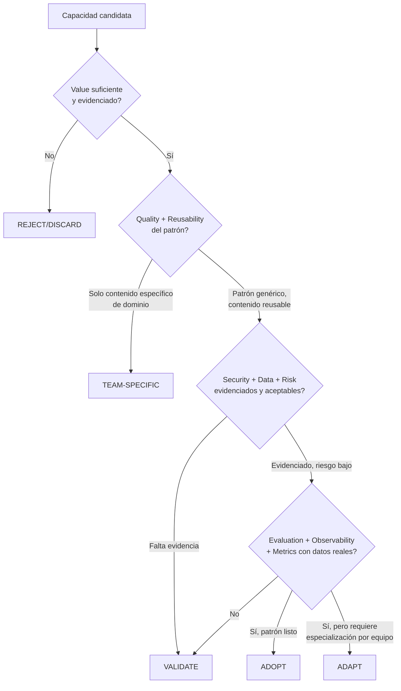

# Assessment Gate

**Fase**: G3.3. **Estado**: PROPOSAL. Este documento **elabora** el gate ya introducido en
[`../../assessment/README.md`](../../assessment/README.md) (pipeline de 11 pasos, vigente
desde G2) — no lo reemplaza. `assessment/README.md` describe el proceso completo
(Problema → ... → Reutilización); este documento define **el rubric concreto** que se
aplica en los pasos "Assessment" y "Validación" de ese proceso.

## Propósito

Dar un modelo de evaluación multi-dimensión para decidir, con evidencia, si una capacidad
debe: **ADOPT · ADAPT · TEAM-SPECIFIC · VALIDATE · REJECT/DISCARD**.

## Principio rector

> No convertir el risk assessment en una puntuación arbitraria si no existe evidencia
> suficiente para definirla.

Este documento **no propone un score numérico único**. Cada dimensión se responde con
evidencia disponible (VERIFIED / PARTIAL / NOT FOUND / REQUIRES VALIDATION), y la
clasificación final es una síntesis razonada, no una fórmula matemática — consistente con
que ninguna evidencia relevada hasta ahora incluye datos suficientes para calibrar pesos
o umbrales (ver Blocked Decision, sección "mecanismo de riesgo", ya señalada en el
Reference Model v0.1 como decisión pendiente).

## Las 14 dimensiones

| # | Dimensión | Pregunta | Ejemplo de evidencia esperada |
|---|---|---|---|
| 1 | **Value** | ¿Qué problema real resuelve, y para cuántos equipos es relevante ese problema? | Caso de uso documentado, no solo "sería útil" |
| 2 | **Reusability** | ¿El patrón (no el contenido) es independiente del dominio de negocio? | Ver `capability-model.md` — ej. el *formato* de Instruction es reusable, el *contenido* de una instruction de AFIP no |
| 3 | **Quality** | ¿El artefacto está bien formado, específico, no genérico? | Cumple el estándar fijado en G2: "un checklist no es automáticamente un Skill" |
| 4 | **Security** | ¿Qué controles tiene si se ejecuta con autonomía? | Ver `security-governance.md` |
| 5 | **Data** | ¿Qué datos toca, y de qué clasificación? | Ver Blocked Decision #3 (clasificación de datos no existe todavía) |
| 6 | **Risk** | Riesgo agregado de habilitar esto más ampliamente | Combinación de Security + Data + Autonomy, no un número aislado |
| 7 | **Integration** | ¿Depende de un MCP/API/Integration, y ese componente está gobernado? | Ver `security-governance.md`, sección MCP |
| 8 | **Autonomy** | ¿Qué nivel de autonomía tiene (ALWAYS/ASK FIRST/NEVER)? | Matriz de autonomía declarada, no implícita |
| 9 | **HITL** | ¿Dónde exactamente hay un punto de validación humana? | Debe ser explícito, no "se supone que alguien revisa" |
| 10 | **Evaluation** | ¿Se evaluó que produce el resultado correcto? | Ver `evaluation-observability.md` |
| 11 | **Observability** | ¿Se puede saber qué hizo en ejecuciones reales? | Ver `evaluation-observability.md` |
| 12 | **Metrics** | ¿Hay medición de impacto, más allá de que "existe"? | Dato real, no proyección |
| 13 | **Ownership** | ¿Quién es responsable de mantenerla? | Persona/equipo identificado, no implícito |
| 14 | **Lifecycle** | ¿En qué estado del Capability Lifecycle está? (`lifecycle.md`, bloque "Capability Lifecycle" — no confundir con Adoption Status ni Deprecation) | Estado explícito, con evidencia de cada transición |

**Nota (G3.3 Corrections)**: este rubric de 14 dimensiones es exactamente lo que se
aplica en el paso `Promote` del Capability Lifecycle (`lifecycle.md`) — `Promote` no es un
estado prolongado, es la decisión/Governance Gate donde este documento se ejecuta. El
resultado (ADOPT/ADAPT/TEAM-SPECIFIC/VALIDATE/REJECT) determina si la capacidad avanza a
`Common Core = Y` (Adoption Status) o vuelve a `Design`.

## Cómo se combina en una clasificación

**Nota de lectura**: este flujo es una guía de razonamiento, no un algoritmo determinista
— dos dimensiones con evidencia parcial no producen automáticamente el mismo resultado en
todos los casos; el Solutions Architect decide con esto como insumo, no como veredicto.

## Resultado del gate — aplicado a la evidencia real de G3.2.5

| Candidato | Value | Reusability | Security/Data/Risk | Evaluation/Obs/Metrics | Clasificación preliminar |
|---|---|---|---|---|---|
| Formato de 4 capas (`copilot-instructions.md`+`instructions/`+`skills/`+`agents/`) | Alto — reduce fricción de onboarding | Alta (es estructura, no contenido) | Bajo riesgo (es convención de archivos) | Sin evaluación pero bajo riesgo intrínseco | **ADOPT como convención**, no como contenido — con la salvedad de que la evidencia de "adopción multi-equipo" debe leerse como autoría concentrada (ver `lifecycle.md`, regla #3) |
| Skill `azure-devops-cli` | Medio-alto (Azure DevOps es transversal) | Alta | Bajo | Sin evaluación real, pero contenido técnicamente verificable (comandos reales) | **ADOPT**, tras reconciliar las 2 versiones existentes |
| Skill `user-story` | Alto (reduce ambigüedad de requerimientos) | Alta (estructura) | Bajo | Sin evaluación | **ADAPT** — generalizar estructura, no fusionar contenido de dominio |
| Skill `dotnet-best-practices` | Alto pero atado a versión de stack | Media (género sí, contenido no) | Bajo | Sin evaluación | **TEAM-SPECIFIC** (contenido) / **ADAPT** (el género como plantilla) |
| Agent `.NET Code Reviewer` (patrón de solo-lectura) | Alto | Alta (patrón de diseño) | **Bajo por diseño** (sin `tools: edit`) | Sin evaluación de si sus hallazgos son correctos | **ADOPT el patrón de gobierno** (scope acotado + sin escritura + severidad estructurada), **VALIDATE el contenido** antes de reutilizarlo tal cual |
| MCP `com.atlassian/atlassian-mcp-server` | Desconocido (no se sabe qué resuelve en producción) | N/A | **Sin evidencia — Security/Data/Risk todos REQUIRES VALIDATION** | Sin evidencia | **VALIDATE — con prioridad de seguridad**, no de reutilización |
| Mecanismo `handoffs` entre Agents | Alto si funciona | Alta (mecanismo) | Medio (orquestación sin supervisión intermedia documentada) | Sin evidencia de ejecución real | **VALIDATE** |
| 8 indicadores de `moa-metrics` | Alto (cubren 6 de 7 categorías de `metrics/framework.md`) | Alta | Bajo (son de solo lectura sobre datos ya extraídos) | Implementados con tests, sin baseline real en producción | **STRONG CANDIDATE → ASSESS → VALIDATE → PROMOTE** (instrucción explícita de G3.3: no redefinir automáticamente como estándar) |

Ningún ítem de esta tabla queda promovido por este documento — es insumo para que el
Solutions Architect decida.
