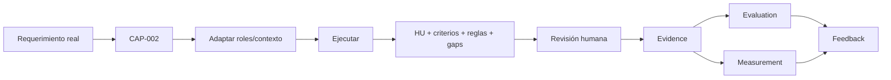

# Golden Paths

Un Golden Path es un camino de adopción guiado — permite que un equipo use una
combinación de capacidades sin tener que descubrir por sí mismo qué combinar y en qué
orden. Ver [`../use-cases/catalog.md`](../use-cases/catalog.md) para los casos de uso
concretos que informan estos caminos.

¿Primera vez acá? Antes de este detalle técnico, conviene ver qué le ofrece este modelo
al rol propio
([`../README.md#3-para-quién-es-y-qué-le-ofrece-a-cada-rol`](../README.md#3-para-quién-es-y-qué-le-ofrece-a-cada-rol))
y qué hace cada capacidad en lenguaje simple
([`../capabilities/README.md#qué-hace-cada-capacidad-explicado-simple`](../capabilities/README.md#qué-hace-cada-capacidad-explicado-simple)).

Cada Golden Path se define con: objetivo, entrada, pasos, capacidades utilizadas, HITL,
evaluación, métricas, salida, criterios de éxito.

De los 6 Golden Paths documentados, solo el primero (AI-Assisted Requirements) tiene su
mecanismo probado de punta a punta — los demás siguen siendo conceptuales, sin ejecución
real todavía. La evidencia real de uso del primero empieza con la prueba en curso de un
developer real de MOA — ver [`../evidence/README.md`](../evidence/README.md) para el
estado vivo.

---

## 1. AI-Assisted Requirements

Consume [`CAP-002`](../registry/entries/user-story.md) (`user-story`).

- **Objetivo**: reducir la ambigüedad y el tiempo de refinamiento de un requerimiento
  antes de que llegue a desarrollo.
- **Entrada**: un ticket o idea de negocio, en lenguaje natural.
- **Pasos**: estructurar como historia de usuario, definir criterios de aceptación,
  identificar reglas de negocio, hacer un análisis de gaps.
- **Capacidades**: Skill `user-story`.
- **Revisión humana**: obligatoria — un PO o referente de negocio debe validar la
  historia antes de pasar a Planning.
- **Evaluación**: ¿la historia cumple el formato y no tiene ambigüedades detectables?
- **Métricas**: historias refinadas por sprint (ver [`../metrics/kpis.md`](../metrics/kpis.md)).
- **Salida**: historia de usuario con criterios de aceptación, lista para Planning.
- **Criterios de éxito**: reducción del tiempo de refinamiento, reducción de historias
  devueltas por ambigüedad — sin baseline medido todavía.

### Dos formas de aportar el contexto

El requerimiento puede entregarse de forma manual, o traerse automáticamente desde un
ticket real:

```text
Contexto manual:
Persona → Contexto escrito a mano → CAP-002 → Revisión humana → Evidence → Evaluation → Measurement → Feedback

Contexto conectado:
Persona → Referencia del ticket → Resolución de contexto → CAP-002 →
Revisión humana → Evidence → Evaluation → Measurement → Feedback
```

En el segundo caso, la referencia (por ejemplo, `MOA-1234`) se resuelve mediante
[`azure-devops-context-provider`](../integrations/azure-devops-context-provider.md) o
[`jira-context-provider`](../integrations/jira-context-provider.md) — ambos de solo
lectura, ver [`../integrations/catalog.md`](../integrations/catalog.md). El resto del
camino es idéntico en ambos casos.

### Empaquetado alternativo: Agent en vez de Skill

Un equipo que prefiera un rol persistente de Product Owner en vez de invocar la skill
directamente puede usar
[`product-owner`](../capabilities/agents/product-owner/AGENT.md) (CAP-012) — misma
lógica de refinamiento de CAP-002, con consulta directa del ticket vía MCP Atlassian de
solo lectura y alcance acotado (`getJiraIssue`, nunca wildcard). `PROPOSAL`, sin
ejecución real todavía — ver la entrada del Registry para el detalle de evidencia y el
hallazgo de seguridad real que motivó el diseño del scope acotado.

### Qué se adapta y qué no

| Elemento | Se adapta por equipo | Por qué |
|---|---|---|
| La secuencia de 4 pasos (estructurar → criterios → reglas → gaps) | No | Es el patrón, reusable sin importar el dominio |
| El formato Historia/Criterios Given-When-Then/RN-XX | No | Convención común, ya convergente entre varios equipos |
| Los roles, ejemplos y contenido de dominio de cada historia | Sí | Cada equipo lo completa con su propio contexto |
| Quién valida y con qué mandato | Sí | Depende de cada equipo |

### Estado real de Evidence / Evaluation / Measurement / Feedback

| Disciplina | Estado hoy |
|---|---|
| Evidence | Sin registros todavía — ver [`../evidence/README.md`](../evidence/README.md) |
| Evaluation | Sin registros todavía — ver [`../evaluation/README.md`](../evaluation/README.md) |
| Measurement | Sin registros todavía — ver [`../measurements/README.md`](../measurements/README.md) |
| Feedback | Mecanismo definido, sin feedback registrado todavía sobre esta etapa |
| Contribution | Mecanismo definido, sin contribución formal aceptada todavía |

Este Golden Path no está declarado "validado" ni "listo para producción" — el mecanismo
está probado, pero la evidencia de uso real recién empieza.

### Cómo adoptar este Golden Path



Evaluation y Measurement no son pasos secuenciales entre sí — ambos consumen la misma
Evidence por separado.

1. Identificar un requerimiento real (ticket, idea de negocio), nunca un ejemplo
   inventado.
2. Seleccionar [`CAP-002`](../registry/entries/user-story.md)
   ([`user-story`](../capabilities/skills/user-story/SKILL.md)).
3. Adaptar roles y contexto al dominio real — ver "Cómo usar esta capability" en la
   propia capability, y [`../adoption/team-adaptation.md`](../adoption/team-adaptation.md).
4. Ejecutar con el asistente de IA disponible.
5. Obtener la historia de usuario, los criterios de aceptación, las reglas de negocio y
   el análisis de gaps.
6. Realizar una revisión rápida por parte de un PO o referente funcional, para detectar
   errores obvios y decidir si el resultado puede continuar.
7. Registrar la Evidence —
   [`../adoption/templates/evidence-record.md`](../adoption/templates/evidence-record.md).
8. Realizar la evaluación formal contra criterios explícitos —
   [Evaluation Record](../adoption/templates/evaluation-record.md).
9. Medir el impacto cuando exista un baseline —
   [Measurement Record](../adoption/templates/measurement-record.md) (dejar explícito
   que no hay medición si no existe baseline, nunca inventarlo).
10. Registrar feedback — [`../adoption/contribution-guide.md`](../adoption/contribution-guide.md),
    con lo que haya resultado de la evaluación y/o la medición.

## 2. AI-Assisted Development

Consume [`CAP-005`](../registry/entries/repository-governance.md)
(`repository-governance`) y [`CAP-004`](../registry/entries/spec-driven-development.md)
(`spec-driven-development`).

- **Objetivo**: reducir el cambio de contexto y el tiempo de desarrollo, manteniendo
  consistencia con los patrones del repositorio.
- **Entrada**: historia de usuario + contexto del repositorio (Instructions de capa).
- **Pasos**: leer las instructions de la capa afectada, consultar skills de dominio si
  corresponde, generar o proponer código siguiendo el Workflow de spec-driven-development
  (nivel Lite recomendado como punto de partida), generar tests, abrir PR, y — al
  terminar — verificar cumplimiento de criterios y cerrar el ticket.
- **Capacidades**: Instruction (`CAP-005`), Skill de dominio, Workflow (`CAP-004`),
  [`pr-description`](../capabilities/skills/pr-description/SKILL.md) (CAP-009) para la
  apertura del PR, [`ticket-closure-assist`](../capabilities/skills/ticket-closure-assist/SKILL.md)
  (CAP-011) para el cierre — ambas `PROPOSAL`, sin ejecución real todavía.
- **Revisión humana**: obligatoria antes de merge — nunca automatizar el merge. Igual de
  obligatoria antes de publicar la descripción del PR o el comentario de cierre.
- **Evaluación**: ¿el código compila, pasa los tests, sigue las convenciones declaradas
  en las instructions? ¿la descripción del PR corresponde al diff real? ¿el cierre
  verifica evidencia real, no una suposición?
- **Métricas**: productividad de los developers, porcentaje de código generado con IA
  (ver [`../metrics/framework.md`](../metrics/framework.md)).
- **Salida**: PR abierto, con tests, y ticket cerrado con evidencia verificada.
- **Criterios de éxito**: menor tiempo de desarrollo sin aumento de bugs — cruzar con el
  Golden Path 4 (Code Review) antes de afirmar esto.

**Nota de alcance**: `pr-description` y `ticket-closure-assist` cubren, respectivamente,
las etapas del KO "Apertura del PR" y "Cierre del ticket" — se incorporan a este Golden
Path en vez de crear uno nuevo por cada etapa, porque ambas extienden el mismo ciclo de
desarrollo que ya describe este camino, de punta a punta.

## 3. AI-Assisted QA

- **Objetivo**: generar casos de prueba y acelerar la validación funcional.
- **Entrada**: historia de usuario con criterios de aceptación.
- **Pasos**: derivar casos de prueba de los criterios, realizar revisión humana de los
  casos, automatizar si corresponde, ejecutar, reportar resultados.
- **Capacidades**: [`test-case-generation`](../capabilities/skills/test-case-generation/SKILL.md)
  (CAP-010) para la generación de casos — `PROPOSAL`, sin ejecución real todavía. La
  automatización de regresión (workflow vía MCP Playwright) sigue sin capacidad ni
  propuesta — depende de un mecanismo de ejecución que no existe en ningún repo de MOA,
  ver `../architecture/ai-sdlc.md` (etapa "Test de regresión", `REQUIRES VALIDATION`).
- **Revisión humana**: obligatoria — QA debe validar los casos generados antes de
  considerarlos parte de la cobertura oficial.
- **Evaluación**: ¿los casos generados cubren los criterios de aceptación reales?
- **Métricas**: tiempo de generación de casos de prueba, bugs detectados en QA y en
  producción.
- **Salida**: suite de casos de prueba con resultados de ejecución.
- **Criterios de éxito**: reducción de bugs escapados a producción.

## 4. AI Code Review

Consume [`CAP-003`](../registry/entries/dotnet-code-reviewer.md)
(`read-only-code-reviewer`) y [`CAP-006`](../registry/entries/stack-best-practices-template.md)
(`stack-best-practices-template`).

- **Objetivo**: detectar problemas de calidad y seguridad antes de merge, sin
  reemplazar la revisión humana.
- **Entrada**: un diff, no el repositorio completo.
- **Pasos**: detectar el contexto (framework/versión), aplicar las skills de buenas
  prácticas del stack, reportar hallazgos por severidad, revisión humana final.
- **Capacidades**: un Agent de solo lectura, sin capacidad de editar código, con alcance
  acotado al diff y salida estructurada por severidad (Critical/Major/Minor).
- **Revisión humana**: obligatoria — el Agent está restringido por diseño a un rol de
  revisión de solo lectura; no decide, solo recomienda.
- **Evaluación**: ¿los hallazgos son precisos, sin falsos positivos que generen fatiga?
- **Métricas**: reliability grade de SonarQube, vulnerabilidades críticas (ver
  [`../metrics/kpis.md`](../metrics/kpis.md)).
- **Salida**: reporte estructurado de hallazgos con una corrección concreta sugerida.
- **Criterios de éxito**: menos bugs y vulnerabilidades llegando a producción.

## 5. Agent Creation

- **Objetivo**: crear un nuevo Agent solo cuando el problema realmente lo justifica, no
  por defecto.
- **Entrada**: un caso de uso donde una Instruction, Skill o Workflow no alcanza porque
  se necesita razonamiento dinámico o selección de herramienta.
- **Pasos**: confirmar que no alcanza con una capacidad más simple, definir las
  herramientas mínimas necesarias, definir una matriz de autonomía (siempre / confirmar
  antes / nunca), definir la revisión humana explícita, pilotar en un alcance acotado,
  evaluar antes de escalar autonomía.
- **Revisión humana**: obligatoria en el diseño mismo, no es opcional.
- **Evaluación**: revisión humana antes de cualquier promoción.
- **Métricas**: no aplica todavía a un Agent nuevo — se define junto con el caso de uso.
- **Salida**: Agent piloteado, con evidencia de evaluación antes de considerarlo algo
  más que un piloto.
- **Criterios de éxito**: el Agent resuelve el problema real declarado, no existe
  simplemente "porque se podía crear un Agent".

## 6. MCP / Integration Onboarding

- **Objetivo**: habilitar una integración externa nueva con el nivel de control
  proporcional a su riesgo.
- **Entrada**: una necesidad concreta de acceso a un sistema externo.
- **Pasos**: completar el modelo de riesgo proporcional, decidir si alcanza con una
  Integration/API directa o se justifica MCP, definir identidad y autenticación con
  alcance mínimo, definir auditoría antes de la primera ejecución, realizar un piloto
  acotado, revisión de seguridad explícita antes de ampliar el alcance.
- **Revisión humana**: obligatoria para cualquier operación de escritura; a definir caso
  por caso para lectura, según la sensibilidad de los datos.
- **Evaluación**: ¿la integración accede solo a lo que declaró necesitar?
- **Métricas**: no aplica hasta que la integración esté en uso real.
- **Salida**: integración documentada en el Registry con su estado de integración
  explícito.
- **Criterios de éxito**: cero incidentes de seguridad, acceso auditable de punta a
  punta.

**Ejemplo de referencia**: [`product-owner`](../capabilities/agents/product-owner/AGENT.md)
(CAP-012) declara `tools: ["com.atlassian/atlassian-mcp-server/getJiraIssue"]` —una sola
operación de lectura, nunca wildcard— como corrección directa del hallazgo de riesgo real
señalado en `governance/BLOCKED-DECISIONS.md` #4 sobre la instancia real de Scato
Logística/Orquestador.

---

## Relación con el resto del modelo

Ningún Golden Path es una capacidad nueva en sí — es una secuencia documentada de
capacidades ya definidas en
[`../architecture/capability-model.md`](../architecture/capability-model.md), con sus
puntos de revisión humana, evaluación y métrica explícitos.
