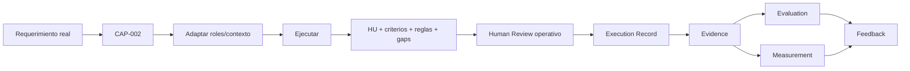

# Golden Paths

**Estado**: PROPOSAL en su mayoría — definición conceptual, no todas implementadas como
capacidades productivas. Ver [`../use-cases/catalog.md`](../use-cases/catalog.md) para
los casos de uso concretos que informan estos caminos.

## Propósito

Un Golden Path es un camino de adopción guiado — permite que un equipo nuevo use una
combinación de capacidades sin tener que descubrir por sí mismo qué combinar y en qué
orden (ver `../architecture/reference-architecture.md`).

Cada Golden Path se define con: objetivo, entrada, pasos, capacidades utilizadas (según
`../architecture/capability-model.md`), HITL, evaluación, métricas, salida, criterios de
éxito.

**Estado por Golden Path**: de los 6 Golden Paths documentados, el #1 (AI-Assisted
Requirements) es el único con el mecanismo probado de punta a punta — las ejecuciones que
lo probaron durante la construcción (dry-runs propios, `PILOT-003`) fueron pruebas del
mecanismo, purgadas al pasar a adopción real; no cuentan como evidencia de uso. La
evidencia real de este Golden Path empieza con la prueba en curso de un developer real de
MOA sobre `ARMOA277-194` — ver `../evidence/README.md` para el estado vivo. **Los Golden
Paths #2 a #6 siguen siendo `PROPOSAL`** — definición conceptual únicamente, sin ejecución
real todavía.

---

## 1. AI-Assisted Requirements

**Estado: mecanismo probado durante la construcción (dry-runs propios + `PILOT-003`),
purgado como evidencia de uso al pasar a adopción real.** Único Golden Path del producto
— deliberadamente no se creó un segundo (regla vigente desde G4.2). Consume **CAP-002**
(`user-story`, [`../registry/entries/user-story.md`](../registry/entries/user-story.md)).
**Sin ejecuciones reales registradas todavía** — la evidencia real empieza con la prueba
en curso de un developer real de MOA sobre `ARMOA277-194` (vía Jira/MCP, bajo
`agent-execution-contract.md`). Ver `../evidence/README.md` para el estado vivo.

- **Objetivo**: reducir ambigüedad y tiempo de refinamiento de un requerimiento antes de
  que llegue a desarrollo.
- **Entrada**: un ticket/idea de negocio, en lenguaje natural.
- **Pasos**: (1) estructurar como historia de usuario, (2) definir criterios de
  aceptación, (3) identificar reglas de negocio, (4) análisis de gaps.
- **Capacidades**: Skill `user-story` (evidencia real en DataAgro, Scato Logística,
  Orquestador — ver `../architecture/assessment-gate.md`); potencialmente un Agent tipo `product-owner`
  (visto en Orquestador, rama no integrada).
- **HITL**: obligatorio — un PO/negocio valida la historia antes de pasar a Planning.
- **Evaluación**: ¿la historia cumple el formato y no tiene ambigüedades detectables?
- **Métricas**: # HU refinadas por sprint (ya definido en `../metrics/kpis.md`).
- **Salida**: historia de usuario con criterios de aceptación, lista para Planning.
- **Criterios de éxito**: reducción de tiempo de refinamiento, reducción de historias
  devueltas por ambigüedad — **sin baseline medido todavía** (mismo REQUIRES VALIDATION
  que el resto de los KPIs del KO).

### Modelo A / Modelo B — 2 variantes del mismo Golden Path, no 2 Golden Paths

**Agregado al implementar Context Acquisition & Resolution**
([`../architecture/context-acquisition-resolution.md`](../architecture/context-acquisition-resolution.md)).
**Es el mismo Golden Path** — la única diferencia es de dónde viene el contexto antes del
paso "Adaptar roles/contexto". Ninguna de las 2 variantes crea una capability nueva.

**Modelo A — Direct Context** (con evidencia real de ejecución):
```text
User → Direct Context → CAP-002 → Human Review → Evidence → Evaluation → Measurement → Feedback
```

**Modelo B — Connected Context**:
```text
User → Reference → Context Acquisition → Resolved Context → CAP-002 →
Human Review → Evidence → Evaluation → Measurement → Feedback
```

En Modelo B, la `Reference` (ej. `MOA-1234`) se resuelve vía
[`azure-devops-context-provider`](../integrations/azure-devops-context-provider.md) o
[`jira-context-provider`](../integrations/jira-context-provider.md) (ambos READ-only,
sección "Ver también" de [`../integrations/catalog.md`](../integrations/catalog.md)) antes
de llegar a CAP-002 — el resto del camino (Human Review → Evidence → Evaluation →
Measurement → Feedback) es **idéntico** en ambos modelos. El mecanismo de ambos modelos
fue probado de punta a punta durante la construcción (pruebas ya purgadas, ver arriba) —
la evidencia real de uso empieza con la prueba en curso sobre `ARMOA277-194` (Modelo B,
Jira/MCP).


### Qué es Common Core y qué es Team Adaptation en este Golden Path (G4.5)

| Elemento | Capa | Por qué |
|---|---|---|
| La secuencia de 4 pasos (estructurar→criterios→reglas→gaps) | **Common Core** | Es el patrón/estructura — reusable independientemente del dominio |
| El formato Historia/Criterios Given-When-Then/RN-XX | **Common Core** | Convención transversal, ya convergente en 3 repos (`../architecture/assessment-gate.md`) |
| El contenido de ejemplos/roles/dominio de cada historia concreta | **Team Adaptation** | Cada equipo lo completa con su propio contexto (confirmado durante las pruebas del mecanismo, ya purgadas — el hallazgo de que el catálogo de roles debía quedar abierto, no cerrado, se mantiene en la propia `SKILL.md`) |
| Quién valida (HITL) y con qué mandato | **Team Adaptation, hoy sin definir** | Depende de cada equipo — y de Blocked #1 a nivel Common Core para el caso de promoción |

### Evidence / Evaluation / Measurement / Feedback / Contribution — estado real (no aspiracional)

| Disciplina | Contrato | Estado real hoy |
|---|---|---|
| Evidence | Evidence Contract (`../architecture/evidence-evaluation-measurement.md#1-evidence`) | **Sin registros todavía** — ver [`../evidence/README.md`](../evidence/README.md) |
| Evaluation | Evaluation Contract (§8) | **Sin registros todavía** — ver [`../evaluation/README.md`](../evaluation/README.md) |
| Measurement | Measurement Result Contract (§10) | **Sin registros todavía** — ver [`../measurements/README.md`](../measurements/README.md) |
| Feedback | `../adoption/contribution-guide.md` | Mecanismo definido, sin feedback real registrado todavía sobre la etapa actual de adopción |
| Contribution | Contribution Model (`../adoption/contribution-guide.md`) | Mecanismo definido, sin contribución formal aceptada al Common Core |

**No se declara este Golden Path "validado" ni "listo para producción"** — el mecanismo
está probado, pero la evidencia de uso real recién empieza (ver `../evidence/README.md`
para el estado vivo).

### How to adopt this Golden Path



Desde **Evidence** salen dos ramas independientes — Evaluation y Measurement no son
pasos secuenciales entre sí.

1. Identificá un requerimiento real (ticket, idea de negocio) — nunca un ejemplo
   inventado.
2. Seleccioná [`CAP-002`](../registry/entries/user-story.md)
   ([`user-story`](../capabilities/skills/user-story/SKILL.md)).
3. Adaptá roles/contexto a tu dominio real — ver "How to use this capability" en la
   propia capability, y [`../adoption/team-adaptation.md`](../adoption/team-adaptation.md).
4. Ejecutá con tu asistente de IA (Copilot, Claude, u otro).
5. Obtené historia de usuario + criterios de aceptación + reglas de negocio + análisis
   de gaps.
6. **Human Review operativo** — revisión rápida por un PO/referente funcional para
   detectar errores obvios y decidir si el resultado puede continuar. **No** equivale a
   la evaluación formal del paso 9.
7. Registrá Execution —
   [`../adoption/templates/execution-record.md`](../adoption/templates/execution-record.md).
8. Registrá Evidence —
   [`../adoption/templates/evidence-record.md`](../adoption/templates/evidence-record.md).
9. **Evaluation** — evaluación formal contra criterios explícitos, registrada mediante el
   [Evaluation Record](../adoption/templates/evaluation-record.md).
10. **Measurement** — medición independiente del impacto cuando existe baseline, con el
    [Measurement Record](../adoption/templates/measurement-record.md)
    (`NOT MEASURED` si no hay baseline, no inventado). No es un paso posterior a
    Evaluation — ambas consumen la misma Evidence por separado.
11. Feedback — [`../adoption/contribution-guide.md`](../adoption/contribution-guide.md),
    con lo que haya salido de Evaluation y/o de Measurement.

**Estado real, sin cambios por agregar esta guía**: 2 controlled dry-runs, ninguna
validación humana independiente, `NOT MEASURED`, **no** `Corporate Standard`. Seguir
estos 11 pasos no convierte al Golden Path en "validado" — lo hace ejecutable por un
equipo nuevo sin depender del arquitecto, que es un problema distinto.

## 2. AI-Assisted Development

**Estado: fortalecido en G5.1 (todavía PROPOSAL)** — antes solo mencionaba
`_sdd/` como Workflow posible sin materializarlo; ahora consume 2 capacidades reales
materializadas: [`CAP-005`](../registry/entries/repository-governance.md)
(`capabilities/instructions/repository-governance/`) y
[`CAP-004`](../registry/entries/spec-driven-development.md)
(`capabilities/workflows/spec-driven-development/`). Ningún Evidence/Evaluation/Measurement Record propio de
*este* Golden Path existe todavía — lo que existe es evidencia real del Workflow que lo
alimenta (2 tickets DataAgro procesados vía CAP-004 nivel Lite), no una ejecución de punta
a punta del propio camino "leer instructions → consultar skill → generar código → tests →
PR".

- **Objetivo**: reducir cambio de contexto y tiempo de desarrollo manteniendo
  consistencia con los patrones del repo.
- **Entrada**: historia de usuario + contexto del repo (Instructions de capa).
- **Pasos**: (1) leer instructions de la capa afectada (`CAP-005`), (2) consultar skills de
  dominio si aplica, (3) generar/proponer código siguiendo el Workflow `CAP-004` (nivel
  Lite recomendado como punto de partida — si hubo investigación real previa o la feature
  expone/consume una API, sumar `research.md`/`contracts/`, ver "Artefactos ampliados" en
  la propia capability), (4) generar tests, (5) abrir PR.
- **Capacidades**: Instruction (`CAP-005`, evidencia real en 4 repos), Skill de dominio,
  Workflow (`CAP-004`, spec-driven development — 2 niveles de madurez + 2 artefactos
  opcionales `research.md`/`contracts/` desde G8, ver su propia capability para la
  distinción Lite/Full).
- **HITL**: revisión humana del PR antes de merge — **no automatizar el merge** (regla ya
  vigente en `AGENTS.md` de DataAgro/Scato Logística: nunca `git push`/merge autónomo).
- **Evaluación**: ¿el código compila, pasa tests, sigue las convenciones declaradas en las
  instructions?
- **Métricas**: productividad DEVs, % código generado con IA (`../metrics/framework.md`).
- **Salida**: PR abierto, con tests.
- **Criterios de éxito**: menor tiempo de desarrollo sin aumento de bugs — cruzar con
  Golden Path 4 (Code Review) antes de afirmar esto.

## 3. AI-Assisted QA

- **Objetivo**: generar casos de prueba y acelerar validación funcional.
- **Entrada**: historia de usuario con criterios de aceptación.
- **Pasos**: (1) derivar casos de prueba de los criterios, (2) revisión humana de los
  casos, (3) automatización (si aplica), (4) ejecución, (5) reporte de resultados.
- **Capacidades**: Skill de generación de casos de prueba (PROPOSED en el KO, sin
  evidencia de implementación real — ver `../use-cases/catalog.md`), Workflow para
  regresión automatizada (mencionado en el KO vía MCP Playwright, sin evidencia real).
- **HITL**: QA humano valida los casos generados antes de considerarlos parte de la
  cobertura oficial.
- **Evaluación**: ¿los casos generados cubren los criterios de aceptación reales?
- **Métricas**: tiempo de generación de casos de prueba, bugs detectados en QA/PROD.
- **Salida**: suite de casos de prueba + resultados de ejecución.
- **Criterios de éxito**: reducción de bugs escapados a producción.

## 4. AI Code Review

**Estado: fortalecido en G5.1 (todavía PROPOSAL)** — el patrón de Agent ahora
está materializado como capacidad reusable
([`CAP-003`](../registry/entries/dotnet-code-reviewer.md),
`capabilities/agents/read-only-code-reviewer/`), y su dependencia de skill de stack
también ([`CAP-006`](../registry/entries/stack-best-practices-template.md),
`capabilities/skills/stack-best-practices-template/`). **Segunda instancia real
encontrada en G5.1**: además de Orquestador (ya conocido), **Scato Logística** también
tiene un agent `dotnet-code-reviewer` real (`model: claude-opus-5`) — refuerza que este
patrón converge de forma independiente, no es un caso aislado. Cero Evidence Records de
una ejecución real de este Golden Path todavía.

- **Objetivo**: detectar problemas de calidad/seguridad antes de merge, sin reemplazar la
  revisión humana.
- **Entrada**: un diff (`git diff --staged` o equivalente) — **no el repo completo**.
- **Pasos**: (1) detectar contexto (framework/versión), (2) aplicar skills de buenas
  prácticas del stack (`CAP-006`), (3) reportar hallazgos por severidad, (4) revisión
  humana final.
- **Capacidades**: Agent de solo-lectura (`CAP-003` — **patrón real y bien gobernado**,
  2 instancias: Orquestador y Scato Logística — `tools` sin `edit`, scope acotado al diff,
  salida estructurada por severidad Critical/Major/Minor — ver `../architecture/assessment-gate.md`).
- **HITL**: obligatorio y explícito en el patrón real encontrado — el agent está
  restringido por diseño a "read-only review role", no decide, solo recomienda.
- **Evaluación**: ¿los hallazgos son precisos (no false positives que generen fatiga)?
- **Métricas**: SonarQube Reliability Grade, vulnerabilidades críticas
  (`../metrics/kpis.md`).
- **Salida**: reporte estructurado de hallazgos con fix concreto sugerido.
- **Criterios de éxito**: menos bugs/vulnerabilidades llegando a producción.

## 5. Agent Creation

- **Objetivo**: crear un nuevo Agent solo cuando el problema realmente lo justifica
  (Principio #7 — no por defecto).
- **Entrada**: un caso de uso donde Instruction/Skill/Workflow no alcanzan porque se
  necesita razonamiento dinámico o selección de herramienta.
- **Pasos**: (1) confirmar que no alcanza con una capacidad más simple (`../architecture/capability-model.md`),
  (2) definir `tools` mínimos necesarios, (3) definir matriz de autonomía ALWAYS/ASK
  FIRST/NEVER, (4) definir HITL explícito, (5) pilotar en alcance acotado, (6) evaluar
  antes de escalar autonomía.
- **Capacidades usadas**: el propio pipeline TRIGGER→CONTEXT→DECISION→ACTION→VALIDATION→
  AUDIT (`../governance/agent-governance.md`).
- **HITL**: obligatorio en el diseño mismo (paso VALIDATION del pipeline) — no opcional.
- **Evaluación**: Human evaluation antes de cualquier promoción (`../architecture/evaluation-observability.md`).
- **Métricas**: no aplica todavía a un Agent nuevo — se define junto con el caso de uso.
- **Salida**: Agent piloteado, con evidencia de Evaluation antes de considerarse más que
  `Pilot` en `../architecture/lifecycle.md`.
- **Criterios de éxito**: el Agent resuelve el problema real declarado, no "porque se
  podía crear un Agent".

## 6. MCP / Integration Onboarding

- **Objetivo**: habilitar una integración externa nueva con el nivel de control
  proporcional a su riesgo (`security-governance.md`).
- **Entrada**: una necesidad concreta de acceso a un sistema externo.
- **Pasos**: (1) completar el modelo de riesgo proporcional (`security-governance.md`,
  sección 1), (2) decidir si alcanza con Integration/API directa o se justifica MCP
  (`../architecture/capability-model.md`), (3) definir identidad/autenticación (cuenta de servicio, scope
  mínimo), (4) definir auditoría antes de la primera ejecución, (5) piloto acotado,
  (6) revisión de seguridad explícita antes de ampliar alcance.
- **Capacidades**: MCP o Integration/API, según el paso 2.
- **HITL**: obligatorio para cualquier operación de escritura; a definir caso por caso
  para lectura, según sensibilidad de datos.
- **Evaluación**: ¿la integración accede solo a lo que declaró necesitar (least
  privilege)?
- **Métricas**: no aplica hasta que la integración esté en uso real.
- **Salida**: integración documentada en `capability-registry.md` con `Integration Status`
  explícito.
- **Criterios de éxito**: cero incidentes de seguridad, acceso auditable de punta a punta.
- **Nota de prioridad**: este Golden Path debería aplicarse retroactivamente al hallazgo
  de `com.atlassian/atlassian-mcp-server` de Orquestador antes de considerar ese MCP
  "resuelto" — hoy no pasó por ninguno de estos 6 pasos de forma documentada.

---

## Relación con el resto del modelo

Ningún Golden Path es una capacidad nueva en sí — es una **secuencia documentada** de
capacidades ya definidas en `../architecture/capability-model.md`, con sus puntos de HITL, evaluación y
métrica explícitos. Ninguno se implementa como capacidad productiva en esta fase.
